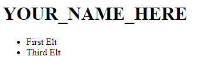
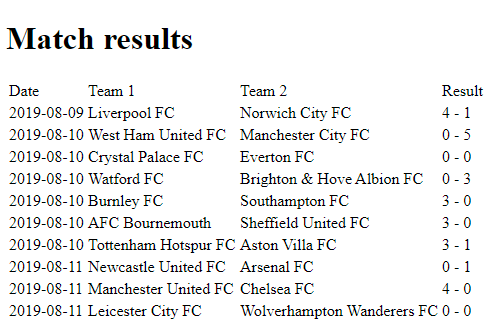
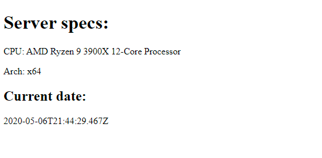

# Kilka ważnych informacji

Przed przystąpieniem do rozwiązywania zadań przeczytaj poniższe wskazówki

## Jak zacząć?

1. Stwórz [*fork*](https://guides.github.com/activities/forking/) repozytorium z zadaniami.
2. Sklonuj repozytorium na swój komputer. Użyj do tego komendy `git clone adres_repozytorium`
Adres repozytorium możesz znaleźć na stronie repozytorium po naciśnięciu w guzik "Clone or download".
3. Rozwiąż zadania i skomituj zmiany do swojego repozytorium. Użyj do tego komend `git add nazwa_pliku`.
Jeżeli chcesz dodać wszystkie zmienione pliki użyj `git add .` 
Pamiętaj że kropka na końcu jest ważna!
Następnie skommituj zmiany komendą `git commit -m "nazwa_commita"`
4. Wypchnij zmiany do swojego repozytorium na GitHubie.  Użyj do tego komendy `git push origin master`
5. Stwórz [*pull request*](https://help.github.com/articles/creating-a-pull-request) do oryginalnego repozytorium, gdy skończysz wszystkie zadania.

Poszczególne zadania rozwiązuj w odpowiednich plikach.

# Poniżej znajdziesz wytyczne do zadań

# Widoki w ExpressJS

Mechanizm schematów i widoków pozwala na przekazanie dokumentu HTML, przygotowanego przez serwer do przeglądarki.

**Pamiętaj o uruchomieniu `npm install` aby przygotować biblioteki przed rozpoczęciem pracy!**

**Zadanie uruchomisz skryptem `npm start`. Kod zadania znajduje się w pliku `task.js`.**

## Widoki - konfiguracja

Twoim zadaniem będzie przygotowanie prostego serwera i szablonu, który wygeneruje stronę "Hello {{NAME}}", według zadanych zasad:

- Fraza `Hello X` powinna być przekazana w tagu `<h1>`, tj: `<h1>Hello, X</h1>`, gdzie X to informacja
    przekazana do serwera w parametrze `req.query.who`
- Tytuł strony, przekazany w obrębie taga `<head>` powinien być równy `Hello World!`
- Serwer powinien nasłuchiwać możliwie na porcie `3000` i reagować na wejście na link `/hello`.

Aby osiągnąć cel, wykonaj następujące kroki:

##### Dodaj brakującą konfigurację serwera w pliku `task.js`

Dodaj konfigurację silnika renderującego EJS i stwórz następujący szablon w pliku `views/hello.ejs`:

```ejs
<!DOCTYPE html>
<html lang="en">
  <head>
    <meta charset="utf-8" />
  </head>
  <body>
  </body>
</html>
```

##### Dodaj do szablonu odpowiedni tytuł w metadanych

Dodaj brakujący tytuł w obrębie tagów `<meta>`

```html
<title>Hello World!</title>
```

##### Dodaj brakujące powitanie

Powitanie powinno być zamknięte w tagach `<h1>`:

```ejs
<h1>Hello <%= greet %></h1>
```

##### Użyj stworzonego szablonu w endpoincie GET

Stwórz nowy endpoint `GET /hello` z użyciem aplikacji ExpressJS, który w rezultacie wyrenderuje HTML z użyciem
silnika. Pamiętaj, iż parametr niezbędny w powitaniu dostępny będzie na parametrze `req.query.greet`.

Jeśli wykonasz zadanie poprawnie, asercje, które odpytują Twój serwer, powinny przestać zwracać błąd.

**PODPOWIEDŹ**

*Pamiętaj, aby ustawić silnik renderujący odpowiednim setterem. Sugerowana nazwa katalogu zgadza się z domyślnym
ustawieniem - nie musisz jej zmieniać*.

**PODPOWIEDŹ 2**

*Jeśli chcesz, możesz sprawdzić kod asercji - powinien Cię on naprowadzić na rozwiązanie, jeśli masz kłopoty z implementacją
któregokolwiek z kroków zadania*.


# ExpressJS - silniki szablonów

ExpressJS oficjalnie wspiera ponad 20 silników renderowania - wybór jednego z nich może być trudny, ale sprowadza się
głównie do osobistych preferencji

**Pamiętaj o uruchomieniu `npm install` aby przygotować biblioteki przed rozpoczęciem pracy!**

**Zadanie uruchomisz skryptem `npm start`. Kod zadania znajduje się w pliku `task.js`.**

## ExpressJS - porównanie silników renderowania

W zadaniu tym porównamy wszystkie cztery spośród wcześniej omówionych silników. Zadanie to jest implementacją
przykładów ze slajdów.

Zmodyfikuj plik zadania tak, aby każdy z czterech widoków, stworzonych w katalogu `views`, był dostępny pod innym endpointem.

Przed miejscem, które masz zmodyfikować, znajduje się obiekt z danymi. Dodaj cztery endpointy, wewnątrz których
wywołasz metody `res.render()` z **dokładnymi nazwami widoków wraz z rozszerzeniami** - dzięki temu ExpressJS
będzie wiedział, który silnik użyć dla którego widoku:

- dla `pug` wyrenderuj plik `comparison.pug`
- dla `ejs` wyrenderuj plik `comparison.ejs`
- dla `Handlebars` wyrenderuj plik `comparison.handlebars`

Przykład wywołania renderingu dla Pug:

```javascript
app.get('/pug', (req, res) => {
  res.render('comparison.pug', data);
});
```

Po dodaniu komend, spróbuj otworzyć każdy z endpointów w przeglądarce i porównać rezultaty. Dodatkowo, asercje znajdujące
się w kodzie powinny przestać zwracać błędy, jeśli zadanie zostało poprawnie wykonane.

Efekt dla każdego z silników powinien być taki sam:



Następnie przyjrzyj się następującym elementom:

- Sprawdź kod każdego z szablonów dla poszczególnych silników i ponumeruj je od 1 do 4, według Twoich własnych
preferencji, gdzie 1 to najbardziej czytelny szablon, a 4 to najmniej czytelny szablon. 
Postaraj się ocenić czytelność samego kodu jako całości, możliwość zawierania kodu JS w kodzie, 
używania zmiennych i czytelność instrukcji (np. pętli, instrukcji warunkowych)
- Sprawdź sposób inicjalizacji każdego z adapterów poszczególnych silników w pliku `internals/initEngines.js` i postaraj
się je ponumerować tak samo, od 1 do 4, gdzie 1 jest silnikiem, który według Ciebie najłatwiej skonfigurować, a 4 to silnik,
który ma wg. Ciebie najtrudniejszą konfigurację

Zapisz rezultaty - wraz z krótkimi komentarzami do ocen - w pliku `engines-ranking.txt`, znajdującym się w repozytorium.

**UWAGA**

*Na potrzeby przykładu pominęliśmy całe "rusztowanie" standardowych dokumentów HTML (head, body itp.) - zwiększa to nieco czytelność szablonów.
W tym wypadku brakujące tagi powinna dodać przeglądarka.*

**HAML - PODPOWIEDŹ**

*Ponieważ HAML nie jest już wspierany (został zastąpiony przez PUG-a, ale dalej jest bardzo popularnym silnikiem),
nie może być zainicjalizowany tak jak inne silniki i musisz przygotować specjalny sposób obsługi widoków dla niego:*

```javascript
app.get('/haml', (req, res) => {
  const hamlView = fs.readFileSync('views/comparison.haml', 'utf8');
  res.end( haml.render(hamlView, {locals: data}) );
});
```

*Powyższy skrypt **bezpośrednio pobierze plik widoku, a następnie
skompiluje go z użyciem metod HAML** - rezultat końcowy będzie nadal taki sam.*

# Handlebars

Handlebars to jeden za najpopularniejszych silników renderowania. Łączy on prostotę z funkcjonalnością i pozwala 
na rozszerzanie jego funkcjonalności z użyciem dodatkowych helperów.

**Pamiętaj o uruchomieniu `npm install` aby przygotować biblioteki przed rozpoczęciem pracy!**

**Zadanie uruchomisz skryptem `npm start`. Kod zadania znajduje się w pliku `task.js`.**

## Handlebars i wyniki meczów

Twoim zadaniem będzie stworzenie tabeli wyników dla zadanych danych. Ostateczny rezultat ma wyglądać tak:



W pliku `internals/data.js` znajdują się wyniki meczów. Każdy z rezultatów wygląda następująco:

```javascript
const result =  {
  date: '2019-08-10',
  team1: {
   key: 'watford',
   name: 'Watford FC',
   code: 'WAT'
  },
  team2: {
   key: 'brightonhovealbionfc',
   name: 'Brighton & Hove Albion FC',
   code: null
  },
  score1: 0,
  score2: 3
}
```

Zbuduj szablon, który na podstawie tablicy takich danych wygeneruje tabelę z następującymi komórkami w wierszach:

- **Date**, odpowiadająca polu `date` z danych
- **Team 1**, pobierająca wartość z pola `team1.name`
- **Team 2**, pobierająca wartość z pola `team2.name`
- **Result**, sklejająca wyniki w postaci `score1 - score2`

Do budowy nagłówka nad tabelą (obrazek) użyj taga `<h1>`. Do budowy tabeli użyj tagów:

- `<table>` dla głównego ciała tabeli
- `<thead>` dla nagłówka tabeli, `<tbody>` dla ciała tabeli
- `<tr>` dla poszczególnych wierszy tabeli
- `<td>` dla komórek tabeli. W wierszu nagłówków użyj nazw przedstawionych w powyższych punktach jako pogrubione

Podstawowa struktura tabeli, na której możesz bazować swoje rozwiązanie mogłaby wyglądać tak:

```html
<table>
  <thead>
    <tr></tr>
  </thead>
  <tbody>
    <tr></tr>
    <tr></tr>
  </tbody>
</table>
```

Więcej o tabelach HTML przeczytasz [tutaj](https://developer.mozilla.org/en-US/docs/Web/HTML/Element/table).

Pamiętaj, iż szablon powinien dynamicznie generować wiersze na podstawie podanych danych. Wykorzystaj też instrukcję
`{{#with}}` w sytuacjach zagnieżdżonych danych - tutaj są to nazwy drużyn.

Pełne rozwiązanie powinno używać instrukcji `{{}}` do wyświetlania wartości zmiennych, `{{#each}}` do stworzenia pętli 
iterującej po kolejnych wpisach z tablicy i `{{#with}}` do wyświetlania zagnieżdżonych wartości.

Zwróć rezultat, używając endpointu `GET /results`, który zwróci wyrenderowany rezultat 
z użyciem `res.render()`:

```javascript
res.render('results', data);
```

(zauważ, iż musisz przekazać do szablonu dane z folderu `internals`, aby dostarczyć mu kontekst renderowania!)

Skonfiguruj wcześnie odpowiednio Handlebars:

```javascript
import express from 'express';
import exhbs from 'express-handlebars'
 
const app = express();
const hbs = exhbs.create();
 
// Add new engine to ExpressJS
app.engine('handlebars', hbs.engine);

// Set chosen view engine
app.set('view engine', 'handlebars');
```

Stwórz szablony `views/layouts/main.handlebars` oraz `views/results.handlebars` i dodaj do nich odpowiedni kod:
- `main.handlebars` powinien zawierać ogólną strukturę strony (patrz PODPOWIEDŹ)
- `results.handlebars` powinien zawierać ciało strony - nagłówek oraz tabelę 

Więcej o adapterze Handlebars do ExpressJS znajdziesz [w jego dokumentacji w NPM](https://www.npmjs.com/package/express-handlebars)

**PODPOWIEDŹ**

*Pamiętaj, iż adapter Handlebars używany w ExpressJS zakłada domyślnie istnienie szablonu domyślnego w `layouts/main.handlebars`.
Stwórz go wraz z podstawową strukturą strony tak jak wcześniej:*

```handlebars
<!DOCTYPE html>
<html lang="en">
<head>
  <meta charset="utf-8" />
  <title>Match results</title>
</head>
<body>
  {{{ body }}}
</body>
</html>
```

Instrukcja `{{{body}}}` zostanie zastąpiona odpowiednim szablonem.

**PODPOWIEDŹ 2**

*Pamiętaj, że rezultaty renderowania znajdziesz domyślnie pod adresem [localhost:3000](http://localhost:3000/results), jeśli odpowiednio
skonfigurujesz endpoint w ExpressJS - otwórz ten link w swojej przeglądarce, aby śledzić postępy w edycji szablonu (musisz
odświeżyć stronę po każdej zmianie)*

**PODPOWIEDŹ 3**

*W tym zadaniu kontekstem przekazanym do szablonu powinien być cały obiekt z pliku `internals/data.js`. Możesz stworzyć
pętlę z jego użyciem, wykorzystując pole `results`:*

```handlebars
{{#each results}}
  {{ date }}
{{/each}}
```

# Handlebars - własne helpery

Handlebars udostępnia mechanizm, pozwalający na tworzenie własnych helperów, dzięki czemu możliwości tworzenia
szablonów są niemal nieograniczone

**Pamiętaj o uruchomieniu `npm install` aby przygotować biblioteki przed rozpoczęciem pracy!**

**Zadanie uruchomisz skryptem `npm start`. Kod zadania znajduje się w pliku `task.js`.**

## "Upiększanie" kodu

Budujesz prosty system raportowy i zauważyłaś/zauważyłeś, iż wielokrotnie w swoich widokach renderowanych na serwerze
używasz tych samych konstrukcji. Decydujesz się na przepisanie ich na helper-y.

Przygotuj dwa helpery - jeden prosty, jeden blokowy:

- prosty helper, który obwinie tekst, przekazany jako jego argument w tagi `<i>YOURTEXT</i>`
- helper blokowy, który doda element div z odpowiednim stylem, który stworzy ramkę wokół jego zawartości

### Rejestracja helper-ów

Adapter Handlebars umożliwia kilka sposobów rejestracji helper-ów - na poziomie renderowania widoku bądź globalnie.

**Na poziomie renderowania widoku**:

```javascript
res.render('home', {
    // Override `foo` helper only for this rendering.
    helpers: {
        foo: function () { return 'FOO!'; }
    }
});
```

**Globalnie**:

```javascript
const hbs = exphbs.create({
    // Specify helpers which are only registered on this instance.
    helpers: {
        foo: function () { return 'FOO!'; }
    }
});
```

W zadaniu (i najczęściej w przyszłości) będziesz używać helperów globalnych. Dodaj oba z helperów globalnie, używając
obiektu konfiguracyjnego przekazanego przy tworzeniu nowej instancji adaptera `express-handlebars`.

### Użycie helperów

W katalogu `views` przygotowany został domyślny widok (który jest też już wykorzystywany w metodzie renderującej).
Twoim zadaniem jest jedynie implementacja helperów - zmień jedynie odpowiednio metodę tworzącą instancję adaptera,
tak aby udostępniała je dla gotowych widoków.

### helper `italic`

Helper ten powinien otaczać przekazany tekst w tagi `<i> your text </i>`. Zauważ, że niezbędnym będzie użycie funkcji
Handlebars procesujących znaczniki:

- Twój tekst może zawierać znaki specjalne. Aby nie "złamały" one składni HTML, musisz użyć `Handlebars.escapeExpression()`
- Rezultat powinien być zwrócony jako poprawny HTML. Aby tak się stało, musisz przekazać go jako argument funkcji `Handlebars.SafeString()`

Obie z wymienionych funkcji dostępne są nie w samym adapterze, ale w bibliotece Handlebars, którą adapter wykorzystuje wewnętrznie -
musisz ją zaimportować, aby móc ich użyć:

```javascript
import Handlebars from 'handlebars';

//...

const hbs = exphbs.create({
    // Specify helpers which are only registered on this instance.
    helpers: {
        foo: function () { return new Handlebars.SafeString('<div>FOO!</div>'); } // Don't forget about "new" keyword!!!
    }
});
```

Jeśli będziesz mieć problem z implementacją helper-a, podobny przykład znajdziesz [w oficjalnej dokumentacji](https://handlebarsjs.com/guide/expressions.html#helpers).

### helper `frame`

Helper ten powinien tworzyć tag `<div>` z odpowiednim stylem, który obwinie zadany kawałek szablonu w ramkę, np:

```handlebars
{{#frame}}
  I should be displayed in the frame
{{/frame}}
```

powinien się stać:

```html
<div style="border: 1px solid black; border-radius: 5px;">
  I should be displayed in the frame
</div>
```

Skopiuj tag `<div>` z powyższego przykładu wraz ze stylem i wykorzystaj go w swoim helperze. Pamiętaj, że aby wstawić
zawartość instrukcji do zwracanego rezultatu, musisz wykorzystać callback `options.fn()`, np:

```javascript
function wrapWithSpan(options) {
  return Handlebars.SafeString('<span>' + options.fn(this) + '</span>');
}
```

### Testowanie rozwiązania

Jeśli chcesz podejrzeć rezultaty po przygotowaniu helper-ów, możesz uruchomić [ten link](http://localhost:3000/helpers)
w przeglądarce.

Rezultat końcowy powinien wyglądać następująco:


Jeśli chcesz sprawdzić dokładniej, jak wygląda szablon, znajdziesz go w `views/helpers.handlebars`.

# Katalogi publiczne

Katalogi publiczne pozwalają na udostępnianie plików klientom - przeglądarkom.

**Pamiętaj o uruchomieniu `npm install` aby przygotować biblioteki przed rozpoczęciem pracy!**

**Zadanie uruchomisz skryptem `npm start`. Kod zadania znajduje się w pliku `task.js`.**

## Rothko w JS

Twoim zadaniem będzie przygotowanie serwera, który udostępni aplikacjom klienckim stronę, wraz z kawałkiem kodu JS,
który narysuje na ekranie w przeglądarce dwa prostokąty.

W pliku zadania znajduje się już wstępnie przygotowany kod aplikacji. Dodaj do niego ponownie silnik renderowania Handlebars,
a następnie udostępnij klientowi następujący endpoint:

- adres endpointu: `/rothko`
- główny layout, 
- widok, renderowany po wejściu na zadaną ścieżkę: `rothko`

Stwórz najpierw layout główny i umieść go w odpowiedniej ścieżce (np. `views/layouts/main.handlebars`):

```html
<!DOCTYPE html>
<html lang="en">
<head>
    <meta charset="utf-8" />
    <title>Rothko</title>
</head>
<body>
  {{{ body }}}
</body>
</html>
```

Stwórz następnie widok, który przygotuje "płótno" i umieść go w pliku `views/rothko.handlebars`:

```html
<div id="canvas"></div>
<script src="rothko.js" type="text/javascript"/>
```

**Pamiętaj, aby odpowiednio rozdzielić właściwy widok od layoutu.**

Aby na ekranie pojawił się obraz, musisz jeszcze dostarczyć przeglądarce kod JS. Stwórz w folderze publicznym (sugerowana
nazwa - domyślna `public`) plik `rothko.js` i udostępnij folder go zawierający przeglądarce, z wykorzystaniem opcji
`app.use(express.static())` z odpowiednim parametrem.

Zawartość pliku JS powinna wyglądać następująco:

```javascript
const smallBlack = document.createRange().createContextualFragment(
  `<div class="small-black" style="position: absolute; bottom: 20px; left: 20px; width: 360px; height: 160px; background-color: #1B1B1B; box-shadow: 0 0 10px 10px #35261A"></div>`);
const smallRed =  document.createRange().createContextualFragment(
  `<div class="small-red" style="position: absolute; top: 20px; left: 20px; width: 360px; height: 560px; background-color: #E43732; box-shadow: 0 0 10px 10px #DC4A30"></div>`);

document.getElementById('canvas').style.position = "absolute";
document.getElementById('canvas').style.top = 0;
document.getElementById('canvas').style.left = 0;
document.getElementById('canvas').style.width = '400px';
document.getElementById('canvas').style.height = '800px';
document.getElementById('canvas').style.backgroundColor = '#EA6F4E';

document.getElementById('canvas').appendChild(smallBlack);
document.getElementById('canvas').append(smallRed);
```

Jeśli chcesz podejrzeć rezultat swojej pracy, powinien on być domyślnie dostępny pod 
[tym adresem](http://localhost:3000/rothko).

Jeśli wykonasz wszystkie elementy poprawnie, ujrzysz obrazek podobny do tego: 


**PODPOWIEDŹ**

*Silnik renderowania dodasz używając biblioteki `express-handlebars`*. Pamiętaj o dodaniu silnika do listy dostępnych
silników przed skonfigurowaniem go na potrzeby aplikacji:

```javascript
import hbs from 'express-handlebars';

// ...

app.engine('handlebars', exphbs());
app.set('view engine', 'handlebars');
```

# SSR - server-side rendering

SSR to technika przygotowywania stron/aplikacji Web po stronie serwerowej i przesyłania ich do aplikacji klienckiej
(przeglądarki) tak, aby użytkownik mógł zobaczyć wyświetloną stonę tuż po otrzymaniu jej z serwera.

Znacząco skraca to czas wejścia w pierwszą interakcję ze stroną, w efekcie poprawiając subiektywne doświadczenie z odbioru
strony.

**Pamiętaj o uruchomieniu `npm install` aby przygotować biblioteki przed rozpoczęciem pracy!**

**Zadanie uruchomisz skryptem `npm start`. Kod zadania znajduje się w pliku `task.js`.**

## Prosty SSR

Server-side rendering może wydawać się dość skomplikowaną koncepcją, ale jego podstawy są bardzo proste. W tym zadaniu
postaramy się zbudować bardzo prosty przykład SSR - nie wykorzystując żadnej biblioteki, a jedynie prosty JavaScript
oraz silnik widoków Handlebars.

Efektem końcowym Twojej pracy powinno być wyświetlenie strony z datą, pobraną z serwera i wskazującą na moment wyrenderowania strony
na serwerze, np:



Aby go osiągnąć, podzielimy naszą pracę na 2 etapy:

- Przygotowanie strony na serwerze, wraz z zasileniem jej stanem
- Zinterpretowanie strony w przeglądarce, wraz z podmianą daty na aktualną i wyświetleniem zmiennej, przekazanej
przez serwer

SSR w tym wypadku obejmie dwie rzeczy - wyświetlenie informacji o maszynie, na której uruchomiony jest serwer, a także
uruchomienie klienckiego kodu JS, który zaktualizuje stronę po wstępnym przygotowaniu.

### Przygotowanie serwera

Podstawowym zadaniem serwera będzie przygotowanie wstępnej wersji strony oraz klienckiego kodu JS, 
który zostanie przekazany do użytkownika.

#### Serwer - przygotowanie widoku

W tym kroku przygotujemy odpowiedni widok. W pliku `views/ssr.handlebars` znajduje się pusty plik, którego zadaniem będzie:

- Wyświetlenie wstępnej wersji strony
- Przekazanie stanu do serwera

Plik ten już jest przesyłany do klienta, jeśli ten wywoła stronę [http://localhost:3000/ssr](http://localhost:3000/ssr).
Wstępna wersja strony powinna wyglądać następująco:

```handlebars
<h1>Server specs: </h1>
<div>
  <p>
    CPU: <span id="specs-info-cpu"></span>
  </p>
  <p>
    Arch: <span id="specs-info-arch"></span>
  </p>
</div>

<h2>Current date: </h2>
<div id="current-date">
  {{ currDate }}
</div>
```

Pola `cpu` i `arch` pozostaw puste - zasilimy je stanem z serwera (jest to czysto demonstracyjne, możesz je przekazać
bezpośrednio do szablonu, ale na potrzeby przykładu - będziemy "nawadniać" stronę tymi danymi po stronie klienckiej).

W pole `currDate` wstaw aktualną datę, wygenerowaną w ramach odpowiedzi na endpoint, np:

```javascript
app.get('/ssr', (req, res) => {
  return res.render('ssr', { currDate: new Date().toISOString() });
});
```

Tak przygotowana strona może zostać wysłana do klienta. Czas dodać do niej dynamiczną zawartość!

#### Serwer - przygotowanie kodu klienckiego (i stanu)

Czas przygotować kod, który zaktualizuje zawartość strony na podstawie danych klienckich i danych z serwera.

Dodaj do projektu instrukcję, która wykorzysta katalog `public` jako publiczny (użyj odpowiednio `app.use(express.static())`).
Następnie stwórz wewnątrz tego katalogu plik `client.js` o następującej zawartości:

```javascript
console.log('I am ready to hydrate!');

setTimeout(() => {
  console.log('Hydrating!');

  // This will hydrate the data
  document.getElementById('specs-info-cpu').innerText = (window.__INITIAL_DATA__ || {}).cpu;
  document.getElementById('specs-info-arch').innerText = (window.__INITIAL_DATA__ || {}).arch;

  // This will simulate activity
  setInterval(() => {
    document.getElementById('current-date').innerText = new Date().toISOString();
  }, 1000);
}, 2000);
```

Plik ten jest stosunkowo prosty:

1. Czeka 2s, aby rozpocząć "zasilanie" strony danymi (symulujemy tutaj czas ładowania np. Reacta czy Angulara)
2. Wkleja zawartość przekazanego z serwera stanu do pól `spec-info-cpu` i `spec-info-arch`
3. Uruchamia interwał, który będzie aktualizował datę co sekundę tak długo, jak otwarte będzie okno przeglądarki

Dla poprawnego działania powyższego kodu brakuje nam dwóch rzeczy - wczytywania go po stronie klienta oraz... Wstępnego
stanu, który w kodzie wyraża się poprzez specjalny obiekt, przypięty do `window`: `window.__INITIAL_DATA__`

Zacznijmy od odwtorzenia stanu. Serwer nie ma możliwości przekazania stanu do klienta poza stroną HTML, ale może
dodać do tej strony dowolny skrypt czy kod. Wykorzystamy tą właściwość, aby stworzyć w szablonie `ssr.handlebars`
dodatkową linijkę ze skryptem, który - gdy zostanie zinterpretowany przez przeglądarkę - doda taki stan.

Dodaj ten kod za ostatnim tagiem zamykającym `</div>` w pliku widoku (na końcu pliku, zauważ, że budujemy obiekt używając
prostego zapisu JavaScript):

```handlebars
<script>
  window.__INITIAL_DATA__ = {
    cpu: '{{ cpu }}',
    arch: '{{ arch }}'
  }
</script>
```

Dodaj zmienne `cpu` i `arch` do metody renderującej odpowiedź u klienta. Ich wartości powinny zostać pobrane metodami
`os.cpu()` i `os.arch()` z pakietu `os` NodeJS:

```javascript
import os from 'os';

console.log(os.cpus()[0].model); // Use first CPU information!
console.log(os.arch());
```

W tym momencie przekazaliśmy już do szablonu wszystkie niezbędne zmienne. Jeśli otworzysz stronę w przeglądarce nic się
jednak nie stanie gdyż... Nadal nie uruchamiamy poprawnie pliku `client.js` w kontekście klienckim!

Na końcu tego samego pliku musimy załadować plik `client.js`, który powinien być już dostępny w Twoim publicznym katalogu
po poprzednich krokach:

```html
<script src="client.js" type="text/javascript"></script>
```

Jeśli wykonasz wszystko poprawnie, proste rozwiązanie renderowania po stronie serwera powinno być gotowe. Gratulacje,
właśnie przygotowałaś/przygotowałeś swój pierwszy kompletny rendering po stronie serwera!

Oto, co będzie działo się na kolejnych jego krokach:

1. Serwer przygotuje wstępny widok i przekaże go do klienta w momencie wejścia w przeglądarce na odpowiednią strone
2. Przeglądarka zintepretuje HTML, który otrzyma i wywoła oba tagi script **w kolejności występowania**
    - najpierw do obiektu okna zostanie dodany stan
    - następnie wywoła się pobrany asynchronicznie z katalogu publicznego skrypt `client.js`
3. Skrypt `client.js` poczeka 2s...
4. Po czym uruchomi resztę wczytywania danych - wstawi dane `arch` i `cpu` na podstawie obiektu stanu, odtworzonego 
z serwera oraz uruchomi interaktywne wyświetlanie aktualnej daty.

---

Repozytorium z ćwiczeniami zostanie usunięte 2 tygodnie po zakończeniu kursu. Spowoduje to też usunięcie wszystkich forków, które są zrobione z tego repozytorium.
