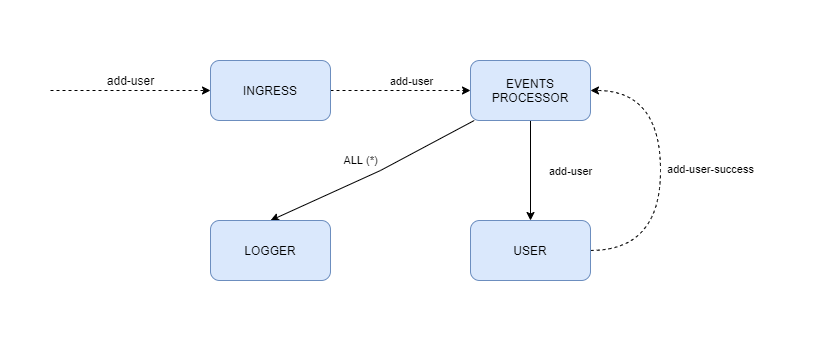
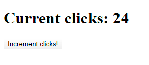
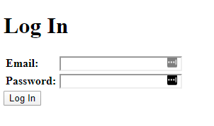

# Kilka ważnych informacji

Przed przystąpieniem do rozwiązywania zadań przeczytaj poniższe wskazówki

## Jak zacząć?

1. Stwórz [*fork*](https://guides.github.com/activities/forking/) repozytorium z zadaniami.
2. Sklonuj repozytorium na swój komputer. Użyj do tego komendy `git clone adres_repozytorium`
Adres repozytorium możesz znaleźć na stronie repozytorium po naciśnięciu w guzik "Clone or download".
3. Rozwiąż zadania i skomituj zmiany do swojego repozytorium. Użyj do tego komend `git add nazwa_pliku`.
Jeżeli chcesz dodać wszystkie zmienione pliki użyj `git add .` 
Pamiętaj że kropka na końcu jest ważna!
Następnie skommituj zmiany komendą `git commit -m "nazwa_commita"`
4. Wypchnij zmiany do swojego repozytorium na GitHubie.  Użyj do tego komendy `git push origin master`
5. Stwórz [*pull request*](https://help.github.com/articles/creating-a-pull-request) do oryginalnego repozytorium, gdy skończysz wszystkie zadania.

Poszczególne zadania rozwiązuj w odpowiednich plikach.

# Poniżej znajdziesz wytyczne do zadań

# MVVM i alternatywy dla MVC

Architektura MVC nie zawsze przystaje do wymagań projektów - często wymaga ona modyfijacji, aby spełnić zadania
stawiane przed nią w ramach konkretnej aplikacji.

**Pamiętaj o uruchomieniu `npm install` aby przygotować biblioteki przed rozpoczęciem pracy!**

**Zadanie uruchomisz skryptem `npm start`. Kod zadania znajduje się w pliku `task.js`.**

## MVVM - model - view - viewmodel

Dzisiejszy Web różni się znacząco od tego sprzed dekady - użytkownicy oczekują od aplikacji dużo więcej,
niż w tamtych czasach. Dzisiejsze aplikacje stawiają na reaktywność i responsywność, dynamiczną prezentację
danych, asynchroniczne ładowanie nowych danych i wiele innych funkcji, które były albo trudne albo
niemożliwe do realizacji w przeglądarkach 10 lat temu.

W związku z tym modelowa architektura MVC, zakładająca, iż to serwer przygotowuje widoki dla użytkownika,
jest już nieco przestarzała.

W ramach modyfikacji tego paradygmatu we współczesnych aplikacjach przeniesiono renderowanie widoków (z wyłączeniem
wcześniej omówionego SSR) na stronę kliencką - zajmują się tym biblioteki takie jak React, Angular, Vue i inne.

Można więc powiedzieć, iż takie podejście jest pewną formą idei MVVM - widok został przeniesiony w
nowe miejsce, gdzie wraz z modelem widoku (viewmodel, za który uznać można warstwę logiki biznesowej
współczesnych aplikacji web, np. przekształcanie danych po zapytaniu do serwera) staje się oddzielnym bytem.

W bieżącym przykładzie Twoim zadaniem będzie przede wszystkim prześledzenie działania aplikacji - kod zadania jest
już gotowy (z racji, iż przedstawiamy tu zewnętrzny framework, którego nie musisz znać - React).

**Aplikację możesz uruchomić, przechodząc pod adres [http://localhost:3000/client](http://localhost:3000/client).**

Przeanalizuj strukturę endpointów aplikacji, a także sposób wysłania plików klienckich do przeglądarki z użyciem
katalogu publicznego. Aplikacja ta zawiera w sobie dwie części:

- Część sewerową, przygotowującą API oraz wystawiającą katalog publiczny do klienta
- Część kliencką, która po pobraniu odpytuje (podobnie jak w przykładzie z widokami) informacje o maszynie, dostarczone
przez serwer i zwraca je w ramach widoku

Zauważ, iż projekt ten **nie ma skonfigurowanych widoków ExpressJS** - cała warstwa wizualna reprezentowana jest
przez bibliotekę ReactJS.

Struktura aplikacji prezentuje się następująco:

```text
- client/* - pliki aplikacji klienckiej
- task.js - główny plik apki serwerowej
- public - katalog publiczny
 |
  - client.js - zbudowany kod aplikacji klienckiej
  - index.html - główny plik HTML, wyświetlany w przeglądarce (ładuje on kod apki klienckiej)
```

**UWAGA**

*W projekcie znajdziesz zarówno kod aplikacji klienckiej w React, jak i zbudowany kod, używany przez przeglądarkę.
Jak to najczęściej bywa z narzędziami front endowymi, aby przygotować aplikację do wyświetlania w przeglądarce,
musi ona zostać odpowiednio zbudowana. Surowy kod kliencki znajdziesz w katalogu `src/client`, natomiast
rezultat w pliku `src/public/client.js` - ten plik właśnie zostanie wykorzystany przez przeglądarkę do
wyświetlenia rezultatu.*

*Kod aplikacji klienckiej może być zbudowany z użyciem skryptu `npm run build-client`.*

# Mikroserwisy

Architektura mikroserwisów rozwiązuje wiele problemów, z którymi borykają się aplikacje monolityczne.
Pozwala ona na znacznie lepszą skalowalność i oddzielenie poszczególnych domen aplikacji jako całości od siebie.

**Pamiętaj o uruchomieniu `npm install` aby przygotować biblioteki przed rozpoczęciem pracy!**

**Zadanie uruchomisz skryptem `npm start`. Kod zadania znajduje się w pliku `task.js`.**

## Mikroserwisy - mini-przykład

W repozytorium znajdziesz gotowy kod mini-przykładu z mikroserwisami. Kod tym razem jest rozproszony pomiędzy
cztery serwisy, każdy odpowiedzialny jedynie za małą część aplikacji.

Twoim zadaniem będzie przyjrzeć się każdemu z mikroserwisów i zrozumieć, jak działa komunikacja. Zapisz w 
repozytorium - w postaci pliku tekstowego bądź prostej grafiki - kolejność **wszystkich wywołań HTTP w systemie** - 
od momentu inicjalizacji pierwszej interakcji przez użytkownika do momentu zakończenia procesowania.
Opisz cały proces, dzieląc go na dwa etapy:

- Uruchamiania serwisów/rejestracji eventów
- Reakcji na zdarzenie użytkownika

Zanim jednak zaczniesz analizę kodu, omówmy sobie jego strukturę. Przygotowana architektura to zbiór bardzo prostych
serwerów - samodzielnych aplikacji, komunikujących się na zasadach przekazywania zdarzeń/nasłuchiwania na zdarzenia
(podobnie do EventEmitterów).

W repozytorium znajdziesz 4 foldery:

- `events-processor` (port `3333`) - zajmuje się procesowaniem kolejki zdarzeń. Jest pośrednikiem w komunikacji
między mikroserwisami
- `ingress` (port `8080`) - punkt wejścia aplikacji. Wyświetla prostą stronę web i przyjmuje zdarzenia od 
użytkownika
- `logger` (port `3001`) - nasłuchuje na wszystkie eventy, a następnie wyświetla prosty log z informacją o zdarzeniu
- `user` (port `3002`) - symuluje zapis użytkownika do bazy poprzez odczekanie 2s i wyzwolenie odpowiedniego eventu

Zależności między tymi serwisami można przedstawić następująco. 

Ciągłe strzałki opisują dodanie subskrypcji na konkretne zdarzenie - 
od momentu subskrypcji dany serwis nasłuchuje na każde zdarzenie o takim identyfikatorze).
Strzałka przerywana to zdarzenie użytkownika - kliknięcie przycisku w przeglądarce bądź przekazanie zdarzenia
dalej:



Graf ten możesz rozumieć tak:

- `ingress` jedynie pośredniczy w przesyłaniu zdarzenia `add-user` od użytkownika/przeglądarki dalej (i renderuje widok 
dla użytkownika)
- `logger` nasłuchuje na każde możliwe zdarzenie w systemie (wyrażone gwiazdką`*`)
- `events processor` jest punktem, który pośredniczy w obsłudze wszystkich zdarzeń. Przesyła je do nasłuchujących
- `user` nasłuchuje na zdarzenie `add-user`, a po zapisaniu użytkownika (w praktyce - zasymulowaniu czasu zapisu), wysyła
zdarzenie `add-user-success`, by poinformować inne systemy o udanym zapisie

Poniżej znajdziesz krótkie omówienie kodu każdego z mikroserwisów

### Events Processor - port `3333`

Procesor zdarzeń jest centralnym punktem, sklejającym wszystkie inne mikroserwisy w całość. W prawdziwych aplikacjach
zwykle nie jest to mikroserwis, a specjalna, dedykowana aplikacja (NodeJS, jak i popularni dostawcy usług, np.
Google Cloud czy Amazon Web Services, dostarczają wielu narzędzi do budowania takich wyspecjalizowanych serwisów).

W naszym przypadku jest to stosunkowo prosta apka, wystawiająca 2 endpointy:

- `POST /event` - zajmuje się przeprocesowaniem zdarzenia i **przekazaniem go do wszystkich nasłuchujących serwisów**
- `POST /listen` - dodaje serwis do listy nasłuchujących na dane zdarzenie. Jeśli przekazana zostanie do niego 
gwiazdka jako nazwa eventu - pozwoli danemu serwisowi nasłuchiwać **na wszystkie wydarzenia w systemie**

### Logger - port `3001`

Nasłuchuje **na wszystkie wydarzenia w systemie**. Dla każdego wydarzenia generuje prosty log w konsoli.

### User - port `3002`

Symuluje zapis użytkownika do bazy (poprzez opóźnienie zdarzenia sukcesu zapisu o dwie sekundy po zdarzeniu 
zlecenia zapisu `add-user`). Zauważ, iż serwis ten **nie jest bezpośrednio związany z żadnym widokiem ani interfejsem
dostępnym dla użytkownika/przeglądarki**. Nie wie on nic o wyglądzie aplikacji ani o sposobie pobierania danych
od użytkownika - wie on jedynie jak zareagować na zdarzenie dodawania nowego użytkownika do systemu.

### Ingress - port `8080`

Ingress to prosty serwer, serwujący jeden widok - stronę HTML z przyciskiem, wyzwalającym endpoint `POST /add-user`.
Wywołanie tego endpointu powoduje przekazanie przykładowych danych użytkownika z przeglądarki dalej - do 
nasłuchującego na zdarzenia Event Processora.

W kodzie Ingress-a możesz znaleźć kod kliencki - przejrzyj katalog `public` oraz `views`, jeśli chcesz zrozumieć
w jaki sposób inicjalizujemy komunikację z mikroserwisami z punktu widzenia użytkownika.

## Uruchamianie apki

Czas uruchomić aplikację! Skrypty uruchamiające podzielone są na dwie grupy:

- `infrastructure` - związane z obsługą systemu jako całości. Uruchamiają `ingress` i `events processor`
- `services` - uruchamiają specjalizowane serwisy - `logger` i `user`.

Czas uruchomić system! Uruchom najpierw skrypt przygotowujący infrastrukturę - `npm run start-infrastructure`,
a następnie - w nowym oknie konsoli, jako oddzielna komenda - uruchom kolejny skrypt `npm run start-services`.

Jeśli wykonasz wszystko poprawnie, system powinien zarejestrować odpowiednie eventy. Otwórz swoją przeglądarkę
na adresie [http://localhost:8080/](http://localhost:8080/), aby wyświetlić przycisk, pozwalający na symulowanie
zapisu danych do bazy.


# Sesja w NodeJS

Sesja to kontekst, pozwalający powiązać ze sobą zapytania wychodzące od tego samego klienta. W NodeJS sesja
reprezentowana jest przez obiekt, dodany do każdego zapytania.

**Pamiętaj o uruchomieniu `npm install` aby przygotować biblioteki przed rozpoczęciem pracy!**

## Kliker

Kliker to urządzenie, które pozwala zliczać zdarzenia poprzez zwiększanie licznika przy każdym kliku. Twoim
zadaniem jest zaimplementowanie wirtualnego klikera z użyciem NodeJS i kawałka kodu klienckiego.

Zanim przystąpisz do rozwiązywania zadania, sprawdź plik `public/clicker.js` - zawiera on kawałek kodu klienckiego,
który dodaje do okna nową metodę: `incrementClicks`.

Metoda ta używa standardowego mechanizmu XMLHttpRequest (bez dodatkowych bibliotek) do wysłania zapytania na 
serwer. Zauważ, iż wywołanie zapytania nie przekazuje żadnych argumentów - ilość klików **jest wyliczana tylko 
i wyłącznie z kontekstu sesji**.

Plik ten zakłada dwie rzeczy:

- W dokumencie HTML istnieje już element o `id` równym `clicks`, który zostanie zmodyfikowany w przypadku powodzenia
w komunikacji z API
- W zakresie komunikacji z API - zakłada on, iż w API istnieje już endpoint `POST /clicks`, który pozwala na zwiększenie
statystyk kliknięć po każdym wywołaniu zapytania.

Twoim zadaniem jest zaimplementowanie obu tych części - brakującego kodu widoku oraz kodu serwera, zarządzającego sesją.

### Zarządzanie sesją z poziomu ExpressJS

Zacznij zadanie od skonfigurowania ExpressJS. Dodaj do aplikacji inicjalizację sesji z dowolnym parametrem `secret`
(nie martwimy się w tym scenariuszu o bezpieczeństwo).

Następnie stwórz dwa endpointy:

- `GET /clicker` - endpoint, który wyrenderuje widok, prezentowany klientowi. Powinien on przekazać do kontekstu
widoku informację o aktualnych kliknięciach: `req.session.clicks`:
- `POST /clicks` - endpoint, którego użyje klient do zaktualizowania wartości kliknięć. Powinien ustawiać wartość
domyślną kliknięć, jeśli ta jest nieustawiona i zwracać obiekt JSON: `{ ok: 'OK' }`.

Kontekst kliknięć możesz przekazać do silnika renderującego tak:

```javascript
res.render('clicker', { clicks: req.session.clicks });
```

Nową wartość kliknięć możesz ustawić tak:

```javascript
req.session.clicks = req.session.clicks ? req.session.clicks + 1 : 1;
```

### Widok

Aby aplikacja zaczęła działać jako całość, musimy jeszcze odpowiednio skonfigurować widok. Zaimplementuj zawartość pliku
`/views/clicker.handlebars`, tak aby:

- zawierał on nagłówek `h1`, z atrybutem `id="clicks"`, który zostanie użyty przez kod aktualizujący kliknięcia
do aktualizacji ich ilości po zmianie. Ustaw wewnątrz niego następujący tekst: `Current clicks: X`, gdzie X to 
wartość przekazana w kontekście renderowania.
- poniżej nagłówka wyświetlał przycisk o treści `Increment clicks!`, który będzie miał dodany atrybut `onclick`, 
wywołujący metodę przypiętą do obiektu globalnego `window` wewnątrz wcześniej sprawdzonego przez Ciebie pliku - 
`clicker.js`

Poza warstwą wizualną - poniżej tagów `<h1>` i `<button>` dodaj dwa tagi skryptów. Pierwszy z nich powinien jedynie
przypisać do okna wartość klików, przekazaną w kontekście renderowania do serwera:

```handlebars
<script type="text/javascript">
  window.clicks = {{ clicks }};
</script>
```

Drugi z plików powinien zaczytywać plik `/clicker.js` - bez tego kawałka cały nasz kod nie zadziała, bo przeglądarka
nie będzie świadoma istnienia dodatkowego pliku JS z kodem, który odpytuje API. Skrypt ten powinien mieć atrybut
`src` wskazujący na plik, dostępny w katalogu publicznym (pamiętaj o bezwzględnej ścieżce do pliku!).

Efekt powinien wyglądać podobnie do poniższego:



### Podsumowanie

Jeśli wykonasz poprzednie kroki poprawnie, Twój "kliker" powinien być gotowy - po otworzeniu strony 
[http://localhost:3000/clicker](http://localhost:3000/clicker) powinien poprawnie wczytać poprzednią wartość kliknięć,
a po kliknięciu na przycisk powinien zaktualizować kliki o jeden.

Spróbuj uruchomić stronę w trybie prywatnym przeglądarki (dostępnym menu każdej popularnej przeglądarki), a następnie
w obu przypadkach porównaj wartość klików. Kontekst sesji możesz znaleźć zaś w narzędziach developerskich, w zakładce
`Application/Cookies/http://localhost:3000` - przyjrzyj się jej zawartości i przyjrzyj się zmiennej odpowiedzialnej
za sesję (`connect.sid`). To ona pozwala na skorelowanie zapytań po stronie serwera. Porównaj wartość tej zmiennej
w trybie standardowym i prywatnym.

Na koniec - zmień kawałek kodu bądź uruchom skrypt ponownie tak, aby zresetować sesję i przyjrzyj się zmianom po stronie
klienckiej.

**UWAGA**

*Pamiętaj, że z racji, iż używamy sesji wraz z domyślnym magazynem, który przetrzymuje informacje o sesji w pamięci
aplikacji, każda zmiana w kodzie (która wyzwoli nowe uruchomienie apki z komunikatem `[nodemon] restarting due to changes...`)
wyczyści wartość tej zmiennej. Tak długo jednak, jak Twoja aplikacja pracuje bez zmian, sesja będzie podtrzymywana*.

# Uwierzytelnianie

Uwierzytelnianie (autentykacja) to niezbędny element każdego systemu, w którym występuje kontekst użytkownika.
Jest to proces, który ma na celu potwierdzenie, iż dany użytkownik jest tym, za kogo się podaje.

**Pamiętaj o uruchomieniu `npm install` aby przygotować biblioteki przed rozpoczęciem pracy!**

**Zadanie uruchomisz skryptem `npm start`. Kod zadania znajduje się w pliku `task.js`.**

## Uwierzytelnianie - strategia lokalna

Czas uzupełnić wiedzę o aplikacjach o zagadnienia uwierzytelniania. W ramach zadania zaimplementujemy prosty
serwer autoryzacji, który sprawdzi podanego użytkownika i hasło, a następnie adekwatnie zareaguje,
zwracając informację, czy podane dane były poprawne.

Twoje zadanie będzie podzielone na dwa etapy:

- Przygotowanie widoku logowania (formularz)
- Przygotowanie konfiguracji lokalnej strategii

Strona testowa powinna być dostępna - po dodaniu przez Ciebie endpointów - pod adresem [http://localhost:3000](http://localhost:3000).

### Widok logowania

Zacznijmy od widoku logowania. Twoim celem jest stworzenie takiego formularza:



Widoki sukcesu i błędu zostały już dodane - będziesz jednak musiała/musiał nadal dodać je do 
Express-a w następnym kroku. Widok logowania znajduje się w obecnie pustym pliku `views/login.handlebars` i musi zawierać:

- nagłówek `<h1>` z treścią taką, jak na obrazku
- formularz z polami (na obrazku zostały one zgrupowane w tabeli) i odpowiednią konfiguracją

Aby formularz działał poprawnie, dodaj do niego właściwe atrybuty:

```handlebars
<form name="login" method="post" action="/login">
<!-- ... -->
</form>
```

Dla uproszczenia zakładamy, iż nazwy pól formularza zgadzają się z tymi oczekiwanymi przez Passport Local:

- pole email powinno mieć typ `email` oraz nazwę `username`
- pole hasła powinno mieć typ `password` oraz nazwę `password`
- przycisk wewnątrz formularza powinien być typu `submit`

### Część serwerowa - konfiguracja Passport

Czas przejść do implementacji Express! W pliku `task.js` skonfigurowano już wstępnie elementy, które niezwiązane
są bezpośrednio z biblioteką **Passport**, Twoim zadaniem jest dodać właściwe endpointy oraz konfigurację Express.

Zacznijmy od konfiguracji - aby Twoja aplikacja mogła uwierzytelniać użytkownika, musisz - poza zainicjalizowanie
Passport-a i dodaniem go jako middleware - dodać odpowiednią konfigurację lokalnej strategii.

Na górze pliku znajdują się dane, których możesz użyć do pseudo-autoryzacji (pamiętaj, że w prawdziwym scenariuszu
użytkownik weryfikowany byłby z bazą danych, a hasło byłoby zaszyfrowane!!!) - `USER_MOCK` i `USER_PASSWORD_MOCK`.

Dodaj do pliku strategię, która porówna parametry wejściowe do tych, przekazanych w ramach autoryzacji i zwróci
odpowiednio callback:

```javascript
passport.use(new LocalStrategy(function(username, password, done) {
  if (username === USER_MOCK.email && password === USER_PASSWORD_MOCK) {
    return done(null, USER_MOCK)
  }

  return done(null, false, { message: 'Combination of username and password not found!' });
}));
```

Zauważ dodatkowy parametr `message` - zostanie on użyty w specjalnym, dodatkowym middleware `flash`, który pozwoli
nam łatwo przekazać tą informację do użytkownika, bez pisania dodatkowego kodu.

Strategia lokalna wymaga dodatkowo - na potrzeby sesji - skonfigurowania serializacji i deserializacji użytkownika.
Funkcje serializujące i deserializujące Passport-a mają na celu:

- deserializująca funkcja zwraca obiekt użytkownika na podstawie sesji w back endzie. Dzięki temu nie musisz przejmować
się ręcznym uzyskiwaniem tych danych (zostaną one dodane na podstawie tej funkcji). Jest ona przydatna z punktu
widzenia serwera - ułatwia dostęp do danych użytkownika
- serializująca funkcja zwraca unikalny identyfikator, który zostanie użyty do powiązania sesji z użytkownikiem.
Zazwyczaj jest to `_id` dokumentu w bazie danych. Jest ona więc przeznaczona do komunikacji z klientem (i utrzymania sesji)

W naszym przykładzie funkcja deserializująca zwróci obiekt użytkownika `USER_MOCK`, a funkcja serializująca - 
jego identyfikator:

```javascript
passport.serializeUser(function(user, cb) {
  cb(null, USER_MOCK._id);
});

passport.deserializeUser(function(id, cb) {
  cb(null, USER_MOCK);
});
```

Bez tych funkcji Passport nie wiedziałby, jak powiązać konkretne zapytania z pozostałymi. Teraz wystarczy jedynie
dodać passport jako middleware, wraz z konfiguracją sesji:

```javascript
app.use(session({ secret: 'SESSION_SECRET' })); // To make authenticated context available for other calls
app.use(passport.initialize());
app.use(passport.session());
```

Jeśli pominęlibyśmy konfigurację sesji, autentykacja dalej by się powiodła, ale niemożliwym byłoby użycie
kontekstu uwierzytelnionego użytkownika w następnych zapytaniach.

Pamiętaj, aby konfiguracja Passport i sesji dodana została do pliku **przed konfiguracją endpointów** - inaczej
może być ona niedostępna i może nie działać poprawnie!

### Część serwerowa - endpointy

Aby "skleić" wszystko razem, potrzebujemy dwóch grup endpointów:

**Endpointy renderujące widoki**:

- `GET /` - główny widok, powinien wyrenderować formularz logowania bez żadnych parametrów
- `GET /login-success` - powinien wyrenderować formularz `login-success` bez żadnych parametrów
- `GET /login-fail` - powinien wyrenderować formularz `login-fail` z dodatkowym parametrem - informacją o błędzie.

Skupmy się na ostatnim widoku - parametr `error` możemy pobrać z kontekstu autentykacji Passport, który używa
biblioteki `flash` - informacja o błędzie zostanie dołączona jako element tablicy do sesji:

```javascript
const session = {
  cookie: { path: '/', _expires: null, originalMaxAge: null, httpOnly: true },
  flash: { error: [ 'Combination of username and password not found!' ] }

}
```

Powyższy listing to przykładowy obiekt sesji, dostępny w ramach obiektu `request` ExpressJS: `req.session`.
Zawiera on informacje o cookie, które pozwala na korelację sesji między serwerem, a klientem, a także - 
wiadomość błędu, dodaną w ramach wiadomości flash w wyniku błędu autentykacji.

Napisz kod, który pobierze pierwszy element tej tablicy i przekaże do widoku `login-fail.handlebars` jako zmienna
znakowa `error`.

### Część serwerowa - operacja logowania

Ostatnim brakującym elementem jest endpoint `POST /login`, który obsłuży samo logowanie. Będzie on wykorzystywał
jedynie Passport jako middleware.

Chcemy, aby w przypadku poprawnego logowania Passport przekierował nas na `/login-success`, a w przypadku jakiegokolwiek
błędu - na `/login-error`. Dodatkowo chcemy dołączyć do zwracanego rezultatu wiadomość flash - tak, aby była dostępna
w ramach widoku niepoprawnego logowania.

Aby osiągnąć taki efekt, możemy wykorzystać opcje Passport:

- `successRedirect` - definiuje przekierowanie na inny endpoint w przypadku powodzenia logowania
- `failureRedirect` - definiuje endpoint wykorzystywany w przypadku błędu logowania
- `failureFlash` - boolean-owa opcja, która zaznacza, iż chcemy dołączenie wiadomości błędu jako wiadomości flash
do sesji (bez tej opcji wiadomość błędu nie występowałaby w kontekście sesji!)

Gotowe zapytanie może wyglądać tak:

```javascript
app.post('/login', passport.authenticate('local', {
    successRedirect: '/login-success',
    failureRedirect: '/login-fail',
    failureFlash: true
  })
);
```

Jeśli wykonałaś/wykonałeś wszystko poprawnie, Twój pierwszy proces uwierzytelnienia powinien być gotowy!
Struktura, którą stworzyliśmy pokazuje, jak skonfigurować Passport z prostą strategią lokalną, zawiera ona
jednak wiele uproszczeń. Aby użyć podobnej konfiguracji produkcyjnie należałoby:

- Zamienić dane mock-owe na prawdziwe, pobierane asynchronicznie z bazy danych
- Hasło z formularza porównywać do prawdziwego hasła użytkownika z użyciem specjalnych, bezpiecznych funkcji, np.
używając biblioteki [bcrypt](https://www.npmjs.com/package/bcrypt) i jej funkcji `bcrypt.compareSync()`
- Użyć bezpiecznej frazy jako klucza/podpisu do sesji - ponownie z pomocą przyjść możę biblioteka BCrypt

---

Repozytorium z ćwiczeniami zostanie usunięte 2 tygodnie po zakończeniu kursu. Spowoduje to też usunięcie wszystkich forków, które są zrobione z tego repozytorium.
