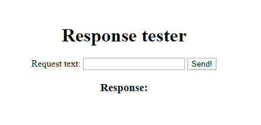
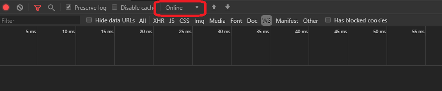
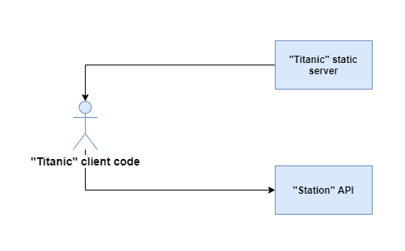
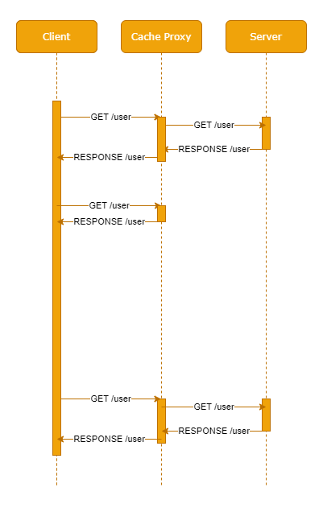

# Kilka ważnych informacji

Przed przystąpieniem do rozwiązywania zadań przeczytaj poniższe wskazówki

## Jak zacząć?

1. Stwórz [*fork*](https://guides.github.com/activities/forking/) repozytorium z zadaniami.
2. Sklonuj repozytorium na swój komputer. Użyj do tego komendy `git clone adres_repozytorium`
Adres repozytorium możesz znaleźć na stronie repozytorium po naciśnięciu w guzik "Clone or download".
3. Rozwiąż zadania i skomituj zmiany do swojego repozytorium. Użyj do tego komend `git add nazwa_pliku`.
Jeżeli chcesz dodać wszystkie zmienione pliki użyj `git add .` 
Pamiętaj że kropka na końcu jest ważna!
Następnie skommituj zmiany komendą `git commit -m "nazwa_commita"`
4. Wypchnij zmiany do swojego repozytorium na GitHubie.  Użyj do tego komendy `git push origin master`
5. Stwórz [*pull request*](https://help.github.com/articles/creating-a-pull-request) do oryginalnego repozytorium, gdy skończysz wszystkie zadania.

Poszczególne zadania rozwiązuj w odpowiednich plikach.

# Poniżej znajdziesz wytyczne do zadań

# Socket.io - odpowiedzi

Socket.io udostępnia mechanizm odpowiedzi na wiadomości (ack), w ramach którego klient bądź serwer może odesłać
informację zwrotną.

**Pamiętaj o uruchomieniu `npm install` aby przygotować biblioteki przed rozpoczęciem pracy!**

**Zadanie uruchomisz skryptem `npm start`. Kod zadania znajduje się w pliku `task.js`.**

**Kod budujący kliencki JS uruchomisz (otwórz nowe okno konsoli) skryptem `npm run client`**

## FooBar

Czas przetestować, jak działają odpowiedzi/potwierdzenia w Socket.io! Twoim zadaniem będzie napisanie prostej
apki serwerowej oraz klienckiej części, która będzie zwracała:

- `Foo` dla każdej liczby parzystej wysłanej z klienta
- `Bar` dla każdej liczby nieparzystej bądź niebędącej liczbą zmiennej

Wykorzystaj mechanizm ACK/odpowiedzi w ramach odpowiednich metod.

### Część serwerowa

Po stronie serwerowej brakuje dwóch metod:
 
- metody renderującej widok `responseTester.handlebars`: `GET /`
- metody Socket.io odpowiadającej na zapytanie/wiadomość `foobar` z klienta.

Zaimplementuj obie metody. W callbacku drugiej metody zaimplementuj logikę taką, jak podana wyżej. 

Sygnatura metody zwracającej odpowiedź wygląda następująco;

```javascript
socket.on('messageName', (data, cb) => {
  // Call callback with some data here, e.g:
  cb('Hello!');
});
```

Gdzie `messageName` to nazwa odbieranej wiadomości, `data` to dane przesłane z klienta, a `cb` to... Callback
w callbacku, który - jeśli wywołany - odeśle dane ze swoich argumentów do klienta.

**Pamiętaj, iż socket połączony z klientem jest dostępny jedynie po podłączeniu się klienta w obrębie callbacku:**

```javascript
server.on('connection', socket => {
  // Perform your operations here
});
```

**PODPOWIEDŹ**

*Pamiętaj, iż dane docierające od klienta mogą nie być liczbą - skonwertuj w callbacku przesłaną od klienta wartość na liczbę,
używając np. `Number()` i dopiero wtedy sprawdź jej podzielność.*

### Część kliencka

W części klienckiej Twoim zadaniem będzie zaimplementowanie prostego formularza **oraz dodanie kodu klienckiego,
który wyśle go z użyciem socketów (a nie metod HTTP!)**.

Aby było to możliwe, musisz dodać w kodzie JS callback, który będzie nasłuchiwał na zdarzenie wysyłania formularze
oraz **zatrzyma wysyłanie tradycyjnymi metodami HTTP** i obsłuży formularz samodzielnie.

Sam formularz musi zawierać:

- unikalny atrybut `id` - tak żeby łatwiej dało się go znaleźć z użyciem kodu JS
- pole tekstowe o unikalnym ID (parametr `name` nie jest ważny, gdyż użyjemy metod DOM, aby pobrać wartość tego
pola w kodzie)
- przycisk `submit` który wyzwoli zdarzenie wysłania formularza.

Cały formularz może wyglądać tak:



Zauważ, iż pole, które może być użyte do wyświetlenia odpowiedzi jest już dodane do szablonu. Dopisz do pliku `client.js` 
kod, który:

- wyśle - po wysłaniu formularza - dane do serwera z użyciem socket.io
- wyświetli rezultat w polu rezultatu `response-container`

Aby móc nasłuchiwać na formularz musisz do niego dodać tzw. event listener (nasłuchiwanie na zdarzenie). Zdarzenie, na które
chcemy nasłuchiwać to `onsubmit`. Zdarzenie to przekazuje w callbacku obiekt zdarzenia, który zawiera specjalne metody,
pozwalające na **zatrzymanie zdarzenia, zanim spowoduje ono reakcję DOM** - w tym wypadku reakcją byłoby wysłanie danych
na serwer poprzez zapytanie HTTP (tak, jak to miało miejsce w poprzednich przykładach) oraz... Przeładowanie strony.

Aby zapobiec temu użyj kodu podobnego do przykładu poniżej (dostosuj niezbędne parametry):

```javascript
document.getElementById('my-form-id').onsubmit = event => {
  event.preventDefault(); // This will prevent default behaviour - sending the form over HTTP

  const myValue = document.getElementById('my-input').value;
  
  // Your socket.io logic below
};
```

Dodaj wewnątrz callbacku w odpowiednim miejscu wywołanie metody emisji socketu wraz z odpowiednią nazwą wiadomości - `foobar`. 
Użyj **ostatniego argumentu metody `emit` tak, aby zareagować na odpowiedź serwera**:

```javascript
socket.emit('some-message', data, response => {
  console.log('Server responded with', response);
});
```

Wewnątrz callbacka odpowiedzi użyj metody `getElementId()` w połączeniu z właściwością `innerHTML` tak, aby w elemencie
`response-container` z szablonu wyświetlona została odpowiedź serwera.

**PODPOWIEDŹ**

*Jeśli do pola tekstowego w formularzu dodasz `type="number"`, zmusisz użytkownika do wprowadzania tylko i wyłącznie cyfr - dzięki temu,
parsując dane na serwerze zawsze otrzymasz poprawną liczbę.*

# Socket.io - odpowiedzi

Pokoje pozwalają zorganizować listę socketów, które podłączone są do serwera, w grupy rozsiewcze, do których serwer
może wysyłać zbiorcze wiadomości.

**Pamiętaj o uruchomieniu `npm install` aby przygotować biblioteki przed rozpoczęciem pracy!**

**Zadanie uruchomisz skryptem `npm start`. Kod zadania znajduje się w pliku `task.js`.**

**Kod budujący kliencki JS uruchomisz (otwórz nowe okno konsoli) skryptem `npm run client`**

## Konferansjer

Twoim celem będzie zaprojektować rozwiązanie, w którym serwer będzie konferansjerem, witającym gości za każdym razem,
gdy do pokoju wejdzie nowa osoba.

Aby wejść do pokoju, apki klienckie będą musiały wysłać specjalną wiadomość: `joinRoom` wraz z imieniem, przekazanym
w parametrze. Konferansjer powinien śledzić osoby dołączające i wychodzące z pokojów. Poprzez śledzenie rozumiemy:

- dodawanie osoby do listy gości za każdym razem, gdy klient wyśle odpowiednią wiadomość do serwera
- za każdym razem, gdy osoba dołączy do pokoju **dopisze gościa do listy tych znajdujących się w pokoju**
- gdy osoba opuści pokój (odłączenie klienta), usunie tą osobę z listy osób w pokoju i poinformuje o tym resztę osób
w pokoju. Opuszczenie pokoju jest **jednoznaczne z wywołaniem zdarzenia `disconnect`**

Za każdym razem, gdy lista powitalna jest opróżniana, serwer powinien wysłać do **wszystkich osób w pokoju** następujący komunikat:

```text
Hello all! We have new member in the room: Y.\n 
There are total Z people in the room, including: \n
- A\n
- B\n
- C\n
```

Znaki nowej linii dodane są dla czytelności. `X` to imię nowej osoby dołączającej do pokoju. `Y` to ogólna ilość
osób w pokoju po dołączeniu nowych osób. `A,B,C` itd. to imiona wszystkich osób w pokoju, wymieniane po kolei (nie musisz
budować listy HTML, prześlij po prostu odpowiednio sformatowaną zmienną string do klienta). Lista ta powinna też zawierać
nowego gościa.

Za każdym razem, gdy osoba wychodzi z pokoju, serwer powinien poinformować o tym resztę:

```text
Hello all! X has left the room, sadly...
```

Gdzie `X` to imię osoby opuszczającej pokój.

### Klient

Klient powinien wyświetlać formularz, podobny do tego z poprzedniego zadania (tym razem oszczędziliśmy Ci pracy i
przygotowaliśmy go za Ciebie):


Formularz powinien być podpięty do kodu JS, który:

1. Doda callback na wydarzenie `onsubmit` formularza
2. Zapobiegnie propagacji zdarzenia dalej (`event.preventDefault()`)
3. Pobierze wartość pola `name`
4. **Zablokuje pole `name`** (możesz to zrobić, przypisując do pola pobranego `getElementById()` wartość `disabled` 
równą `true`)
5. Wyśle wartość tego pola do serwera w ramach wiadomości `joinRoom`

Uwaga! Ponieważ chcemy aby każdy klient (de facto każda zakładka/proces w przeglądarce) mogły być unikalnie rozpoznawane
przez konferansjera-serwer, niezbędne jest przypisanie do klienta unikalnego ID. Prześlij wygenerowane przy użyciu
dostępnej w kodzie funkcji `generate` (import `randomstring`) wartość `clientId` do serwera podczas inicjalizacji socketu:

```javascript
const socket = io({
  query: {
    clientId,
  }
});
```

Klient powinien też reagować na przywitanie konferansjera - wiadomość `greeting`, której wartość powinna być ustawiona
w polu `response-container` za każdym razem, gdy przyjdzie nowa wiadomość.

### Serwer

Serwer powinien przetrzymywać listę znajdujących się w pokoju osób tak, aby móc skorelować każde `clientId` z odpowiednim
imieniem. Proponowana jest następująca struktura:

```javascript
const guests = {
  clientId: 'clientName'
}
```

Gdzie `clientId` będzie parametrem przesłanym w ramach `query` w momencie połączenia klienta, a `name` będzie imieniem
pobranym z formularza i przekazanym w ramach wiadomości `joinRoom`.

Serwer powinien udostępniać ekran powitalny (zawarty w szablonie `room`) w ramach endpointu `/GET`. Poza tym powinien
on odpowiednio reagować w ramach komuniacji Socket.io:

1. W momencie nawiązania połączenia z klientem powinien pobrać jego id (powinno się ono znajdować w polu 
`req.handshake.query.clientId`, jeśli klient je poprawnie przesyła)
2. Powinien rozpocząć nasłuchiwanie na 2 zdarzenia:
    - `joinRoom`, w momencie gdy klient jawnie wywoła dołączanie do pokoju po podaniu imienia i wysłania formularza
    - `disconnect` po zamknięciu zakładki/odłączeniu socketa
    
**W ramach zdarzenia `joinRoom`:**

1. Serwer powinien sprawdzić, czy gość jest już w pokoju (sprawdzając, czy jakakolwiek wartość - imię istnieje w 
liście gości pod jego identyfikatorem)
2. Jeśli gość **jeszcze nie dołączył do pokoju** serwer powinien:
    - dodać go do listy (`guests[clientId] = name`)
    - zebrać imiona wszystkich gości, np. z użyciem `Object.values()` na obiekcie listy gości
    - przygotować wiadomość powitalną według kryteriów opisanych wcześniej
    - dodać socket klienta do pokoju `meeting`, wywołując `socket.join()` z nazwą pokoju
    - wysłać wiadomość powitalną **do pokoju** (z użyciem `server.to().emit()`)

**PODPOWIEDŹ**

*Zawuaż, iż to socket dołącza i wychodzi z pokoju, ale to **główne połączenie serwera (`server` w kodzie)** wysyła
wiadomości do pokoju!*

**W ramach zdarzenia `disconnect`:**

Serwer powinien wyczyścić stan pokoju - usunąć z niego danego użytkownika. Czyszczenie powinno objąć:

1. Wysłanie wiadomości do pokoju `meeting` o opuszczeniu pokoju, wg. wcześniej zadanych zasad
2. Wywołanie `socket.leave()`, aby dla pewności usunąć użytkownika z pokoju (w normalnej sytuacji byłoby to zbędne,
ale jest to dodatkowe zabezpieczenie na wypadek np. wycieków pamięci - użytkownik i tak zamyka socket)
3. Usunięcie gościa z obiektu gości serwera (tak, aby nie zaśmiecał on tej listy): `delete guests[clientId]`

Jeśli przygotujesz już całe rozwiązanie, możesz otworzyć kilka tabów w Twojej przeglądarce i dołączyć kilku użytkowników
do pokoju. Nastepnie zamknij kilka z tabów i zobacz, czy wiadomość pożegnalna została poprawnie wysłana do wszystkich
klientów.

**UWAGA!**

*Pamiętaj, że lista socketów i imion jest zapamiętywana w kontekście jednego uruchomienia serwera. Dowolna zmiana w kodzie
spowoduje przeładowanie serwera, a więc także - zamknięcie wszystkich socketów i stworzenie nowego obiektu `guests`. 
Jeśli przeładujesz serwer, musisz też odświeżyć okna przeglądarki, aby nawiązać połączenia na nowo.*
 

# Statyczny hosting

Statyczny hosting to sposób serwowania danych klienckich, w którym kod przeglądarkowy jest całkowicie oddzielny
od kodu serwerowego.

**Pamiętaj o uruchomieniu `npm install` aby przygotować biblioteki przed rozpoczęciem pracy!**

**Zadanie uruchomisz skryptem `npm start`. Kod zadania znajduje się w pliku `task.js`.**

**Kod budujący kliencki JS uruchomisz (otwórz nowe okno konsoli) skryptem `npm run client`**

## Statyczny "Hello World"

W repozytorium jest już gotowe rozwiązanie MVC, generujące "Hello World" bez udziału kodu klienckiego - wykorzystuje
ono kontekst przekazany do szablonu.

Twoje zadanie jest tym razem stosunkowo proste - wprowadź zmiany do repozytorium, które wyrenderują identyczną stronę,
ale jedynie z użyciem statycznego hostingu.

Aby to osiągnąć:
1. Przygotuj w serwerze endpoint (`GET /hello`, który odtworzy dynamiczne zachowanie szablonu - przekaże do kodu klienckiego 
wiadomość JSON `"Hello World"` wraz z datą, tak aby statycznie wyrenderowany klient także mógł wyświetlić dynamiczną treść wiadomości
2. Usuń endpoint renderujący widok **wraz z całym kodem zależnym handlebars**:
    - usuń inicjalizację i importy Handlebars
    - usuń powiązane paczki z pliku `package.json`, a następnie zregeneruj plick lockfile, uruchamiając
    `npm install` albo `yarn` (zależnie od menedżera pakietów, którego używasz)
3. Dodaj do folderu `public` plik `index.html`, którego zawartość będzie odtworzoną zawartością z widoków `main.handlebars`
oraz `hello.handlebars`. Pamiętaj, że będzie to czysty HTML, wobec czego instrukcje `{{}}` nie będą działały:
    - instrukcję wstawiającą `{{body}}` w głównym layoucie zastąp zawartością pliku `hello.handlebars` 
    - instrukcję wstawiającą `{{message}}` w miejscu przyszłej wiadomości na razie usuń
    
Teraz spróbuj odświeżyć okno. Jeśli wykonałaś/wykonałeś kroki poprawnie, Twoim oczom powinna ukazać się **pusta
strona z odpowiednim tytułem i strukturą** - zbadaj ją w DevToolsach.

**UWAGA!**

*Jeśli chcesz "na żywo" porównać obie wersje w ramach finalnego kroku zadania, 
możesz zostawić sobie usuwanie Handlebarsów/widoków na później - nowe i stare
rozwiązania mogą żyć obok siebie tak długo, jak endpoint `GET /` i `public/index.html` nie będą ze sobą kolidowały.
Aby to osiągnąć możesz np. dodać prefiks do oryginalnego endpointa: `GET /old`.*

Czas dopisać kod kliencki, który wklei wiadomość w treść strony. Dodaj do `index.html` do taga `<h1>` w którym oryginalnie
w szablonie wstawiała byłą wiadomość unikalny identyfikator.

Teraz z poziomu kodu `client.js` stwórz asynchroniczną funkcję, która wywoła się w momencie załączenia pliku do `index.html`:

```javascript
(async function() {
  // HERE - implement your code
})();
```

Jest to tak zwana IIFE - Immediately Invoked Function Expression - funkcja, która zostaje natychmiast wywołana i 
izoluje swoje działanie. Dzięki takiemu zapisowi możesz ją automatycznie uruchomić w momencie zaimportowania/uruchomienia 
pliku ją zawierającego. Pozwala ona też na użycie `async/await` bez konieczności ręcznego jej wywoływania w kodzie - 
można powiedzieć, iż wywołuje się ona sama.

W ramach funkcji:

- wykonaj zapytanie do serwera z użyciem `axios`
- użyj `document.getElementById()` z wcześniej stworzonym identyfikatorem taga tak, aby wstawić do tego taga dane
z odpowiedzi serwera

Pamiętaj, aby na końcu pliku `index.html` dodać wywołanie Twojego klienckiego kodu JS z użyciem:
 
```javascript
<script src="/client.js" 
```

Porównaj finalny wynik z oryginałem - zapisz wnioski do pliku `results.txt`. Obserwuj wygląd strony w czasie zapytania do serwera.
Jeśli nie widzisz znacznej różnicy (Twoja maszyna może być... Za szybka)), wejdź w DevTools Twojej przeglądarki
i w zakładce Network (w przypadku Chrome) odszukaj listę rozwijalną, taką jak ta:



Zmień obecną wartość na jedną z wolniejszych opcji. Przeładuj stronę ponownie i postaraj się porównać z oryginalną
implementacją (mamy nadzieję, że z rozpędu nie usunęłaś/usunąłeś widoków!) - możesz zrobić to łatwo, zmieniając
oryginalny usunięty endpoint `GET /` na np. `GET /comparison` i renderując oryginalny szablon.

Obserwuj przede wszystkim to, jak długo zajmuje załadowanie się strony (spinner w zakładce przeglądarki) oraz
kiedy pojawia się wiadomość z serwera.

# Statyczny hosting a CORS

CORS (Cross-origin resource sharing) to funkcjonalność, która znacznie zwiększa bezpieczeństwo kodu klienckiego -
bez zgody serwera klient może porozumieć się jedynie z tą samą domeną bądź **z domeną, w której serwer jawnie dopuszcza
komunikację z klientem z określonej domeny**

**Pamiętaj o uruchomieniu `npm install` aby przygotować biblioteki przed rozpoczęciem pracy!**

**Zadanie uruchomisz skryptami `npm run dock` i `npm run station`. Kod zadania znajduje się w plikach `dock.js` i `station.js`.**

**Kod budujący kliencki JS uruchomisz (otwórz nowe okno konsoli) skryptem `npm run titanic`. Kod ten znajduje się w pliku `titanic.js`.**

## Mayday!

Jeśli kiedykolwiek widziałaś/widziałeś model sławnego statku, który zatonął 15 kwietnia 1912 roku (bądź było Ci
dane zobaczyć film z 1997 roku, w którym statek ten był tłem i który wygrał 11 Oscarów), mogłaś/mogłeś zauważyć, 
iż na dziobie statku oraz na jego rufie znajdowały się bardzo charakterystyczne słupy, na których rozpięte były przewody, 
przypominające nieco starodawne słupy telegraficzne:


Była to antena - w czasach Titanica komunikacja odbywała się jedynie za pomocą fal długich, które przemierzały tysiące
kilometrów, podążając krzywizną Ziemi, będąc narażonymi na wygaszenie przez sztormy i inne zjawiska atmosferyczne ale nadal
często okrążającymi Ziemię. Jedynym sposobem, aby skutecznie odebrać sygnał o takiej charakterystyce na takiej odległości była 
budowa anteny, która była wystarczająco duża (a konkretnie - długa), aby móc "rezonować" z falą. Aby stacja odbiorcza mogła odebrać informacje ze statku, musiała nasłuchiwać
na **określony sygnał** -  w szumie setek innych sygnałów od innych statków, stacji i samolotów - 
była ona zsynchronizowana z tym jednym konkretnym sygnałem oraz nasłuchiwała na określone wywołania (ignorowała inne
sygnały) - takie rozwiązanie gwarantowało bezpieczną i skuteczną komunikację.

Podobnie działa CORS - celem tej funkcjonalności jest filtrowanie tylko i wyłącznie tego kodu klienckiego, który 
ma uprawnienia aby komunikować się z serwerem. Jeśli CORS jest poprawnie skonfigurowany, żaden "szum" od kodu
rezydującego w innych, nieobsługiwanych domenach nie może zostać przez serwer wysłuchany i jest pomijany już
na poziomie pierwszego zapytania przeglądarki, tzw. pre-flightu.

Twoim zadaniem dzisiaj będzie implementacja takiej komunikacji, wraz z odpowiednią konfiguracją CORS. W folderze zadania
znajdziesz cztery kluczowe pliki:

- `dock.js` - w tym pliku będziesz implementować serwer, statycznie hostujący pliki.
- `public/index.html` - plik indeksu dla kodu klienckiego. Musisz go zmodyfikować tak, aby wstrzykiwał...
- plik `titanic.js` - kliencki kod JS, który będzie próbował nawiązać komunikację ze...
- `station.js` - stacja bazowa. Druga apka ExpressJS (bez statycznego hostingu), która będzie nasłuchiwała **tylko i wyłącznie
na sygnały z odpowiedniego adresu** i odpowiadała.

W praktyce można zwizualizować zależności między tymi plikami tak:



### Serwer statyczny - **Dock**

Serwer statyczny powinien jedynie udostępniać katalog `public` na porcie **3001**.

### Kod kliencki - **Titanic**

Kod ten powinien być hostowany przez **Dock** z użyciem statycznego hostowania plików (pamiętaj, iż plik, który
zostanie stworzony w katalogu `public` zostanie wygenerowany bundlerem uruchamianym skryptem `npm run titanic`).

Zadaniem tego kodu jest wywoływanie zapytania `POST /message` w pętli, próbując skomunikować się z serwerem **Station**.
Serwer ten będzie uruchomiony na innym porcie - pamiętaj, aby podać odpowiedni adres w parametrach `Axios`!

Kod ten powinien wywoływać powyższe zapytanie zawsze z następującym payloadem:

```json
{
  "message": "Mayday! Mayday! We are sinking!"
}
```

Zapytanie powinno być powtarzane tak długo, aż klient otrzyma co najmniej jedną odpowiedź na nie. Jeśli odpowiedź nie przyjdzie
(bądź przeglądarka zwróci błąd), zapytanie powinno być powtórzone 10 razy, po czym.... Titanic zatonie.

Zaimplementuj następującą logikę:

1. Dodaj kod, który w pętli (`setInterval`) wywołuje zapytanie `POST /message` **co 2 sekundy** i wstawia rezultat 
(odpowiedź serwera bądź wiadomość z błędu) do taga `<h1 id="ahoy">` (znajdziesz go w kodzie HTML - `public/index.html`)
2. Kod ten powinien przestać wysyłać wiadomości, jeśli co najmniej raz otrzyma poprawną odpowiedź od serwera **Station**.
3. Jeśli zwrócony zostanie błąd - obsłuż go w bloku `catch`, a następnie wstaw w ten sam tag. 
4. W przypadku błędu ponawiaj zapytanie tak długo aż...
5. Osiągniesz 10 powtórzeń - wtedy wstaw w tag `<h1>` tekst : `It looks like you will get your headlines after all, Mr. Ismay…`

*Nie zapomnij dodać taga `<script>` na końcu pliku `index.html` aby załadować swój kod!*

*Pamiętaj, iż strona będzie teraz dostępna pod adresem `http://localhost:3001` - takim, jak statyczny serwer.*

### Serwer API - **Station**

Zaimplementuj serwer API, który uruchomiony będzie na innym porcie - **3000** tak, aby obsługiwał endpoint `POST /message`,
który może być wysłany przez klienta i - w przypadku otrzymania wiadomości - odsyłał odpowiedź, doklejoną do oryginalnej
wiadomości w nowej linii:

```javascript
const response = {
  message: `${req.body.message} \n Roger, sending help!`
}
```

Zaimplementuj go najpierw bez CORS, a następnie dodaj odpowiedni middleware. Jeśli uda Ci się uratować Titanica od zatonięcia,
spróbuj ograniczyć middleware do konkretnego adresu hosta, przekazując mu opcję `origin`, która może wyglądać tak:

```javascript
const corsOptions = {
  origin: 'http://some-client-address:3030'
}
```

Więcej o opcjach tego middleware znajdziesz [w jego dokumentacji](https://www.npmjs.com/package/cors)

Spróbuj zmodyfikować przekazywany `origin` tak, aby odpowiadał adresowi i portowi klienta (pamiętaj, iż klient jest udostępniany
przez serwer **Station**, wobec tego będzie dostępny na tym samym porcie!), a następnie zmień go na niepasujący i spróbuj
ponownie po odświeżeniu przeglądarki.

Zapisz analizę błędów do pliku `results.txt` w repozytorium.

**PODPOWIEDŹ**

*Aby zatrzymać interwał po 10 wywołaniach, użyj instrukcji `if` z odpowiednim warunkiem oraz identyfikatora interwału:

```javascript
const myInterval = setInterval(() => {}, 2000);

// ... Later in the code
clearInterval(myInterval);
```


# Serwer cache

Serwer cache - caching proxy - to aplikacja, która optymalizuje wywołania na styku klient-serwer. Dla każdego zapytania,
które generuje odpowiedź, która już wystąpiła w systemie, używa on gotowe

**Pamiętaj o uruchomieniu `npm install` aby przygotować biblioteki przed rozpoczęciem pracy!**

**Zadanie uruchomisz skryptami `npm start` i `npm run proxy`. Kod zadania znajduje się w plikach `task.js` i `proxy.js`.**

**Kod budujący kliencki JS uruchomisz (otwórz nowe okno konsoli) skryptem `npm run client`**

## Leniwy serwer

Serwer cache nie musi być skomplikowany - aby zbudować prosty serwer, który będzie miał możliwość 
cache-owania zapytań, wystarczy zaledwie kilkanaście linijek kodu.

Najprostrze założenie przy cache-owaniu zapytań jest takie, iż każde zapytanie generuje taką samą odpowiedź - szczególnie,
jeśli zostanie powtórzone w krótkich ramach czasowych. Nie zawsze jest to prawdą, ale na potrzeby najprostszej implementacji
wystarczy. Działanie serwera cache można zobrazować następująco:



Zauważ, iż drugie z trzech wywołań endpointu `GET /user` nie dociera nawet do serwera. Dzieje się tak, ponieważ proxy zakłada,
iż zapytanie zadziało się na tyle szybko po poprzednim, że dane użytkownika nie zmieniły się.

Następne zapytanie (po jakimś czasie) ponownie odpytuje użytkownika - nastąpiło ono po okresie, w którym cache było jeszcze 
ważne, więc proxy ponownie wywołało zapytanie na serwerze.

Taka idea jest **podstawową ideą stojącą za proxy cache-ującymi**. Rrzeczywiste proxy są oczywiście dużo bardziej skomplikowane
i uwzględniają dużo więcej czynników, taka najprostsza implementacja jednak obrazuje zasadę ich działania.

W pliku `task.js` znajduje się kod serwera, który odpowiada na zapytanie `GET /user` danymi użytkownika z tym, że...
Serwis symulujący zwracanie danych jest bardzo powolny. W efekcie zapytanie potrzebuje ponad 1,5 sekundy, aby zostać
zwrócone do użytkownika.

W tym zadaniu możesz odpocząć od budowania części klienckiej - Twoim zadaniem będzie jedynie zmodyfikowanie pliku `proxy.js`
tworząc w nim middleware, który przekieruje **wszystkie zapytania na zmodyfikowany URL ze zmienionym portem**, zapisując
odpowiedzi serwera na czas 5 sekund i re-używając ich na potrzeby komunikacji z klientem.

Przypomnienie - każdy middleware w ExpressJS ma następującą sygnaturę:

```javascript
export const someMiddleware = (req, res, next) => {
  next();
};
```

Gdzie `next()` to callback, który może albo przekazać procesowanie dalej albo zwrócić błąd.

Użycie middleware na poziomie całej apki wygląda tak:

```javascript
app.use(someMiddleware);
```

Zbuduj middleware w serwerze proxy uruchomionym na porcie **3001**, który:

1. Sprawdzi, jaki jest URL zapytania (właściwość `req.url`) oraz metoda (`req.method`)
2. W bloku try/catch...
3. Sprawdzi, czy w obiekcie `cache` istnieje już odpowiedź dla takiego URL
4. Jeśli odpowiedzi nie ma:
    - Wykona zapytanie `axios.get` do prawdziwego serwera z pytaniem o zasoby
    - Zapisze odpowiedź pod odpowiednim kluczem URL w cache
    - Uruchomi timeout, który wyczyści cache po **5 sekundach**
    - Zwróci do klienta JSON z odpowiedzią dla prawdziwego serwera
5. Jeśli odpowiedź istnieje w cache, zwróci zapisaną wcześniej odpowiedź

Dodatkowo, sprawdź w warunku, czy metoda jest wspierana:

```javascript
if (!cache[url] && method === 'GET') {
// Perform caching here
} else if (method !== 'GET') {
  return res.status(400).json({ err: 'Unsupported method!' });
}

return res.json(cache[url]);
```

Dla uproszczenia zakładamy, iż nasze cache działa **tylko i wyłącznie** dla metod `GET` (obsłużenie
metod przesyłających parametry w `body` niepotrzebnie by skomplikowało zadanie).

Jeśli wykonasz zadanie poprawnie, uruchom Postman-a i wykonaj kilka zapytań `GET /user` do adresu serwera
proxy oraz do prawdziwego serwera. Porównaj zachowanie się obu z uwzględnieniem czyszczenia cache po czasie
**5 sekund**. Wnioski zapisz do pliku `results.txt`.

Zaledwie kilkanaście linijek kodu pozwoliło nam na zbudowanie bardzo prostego cache dla zapytań `GET`.
Zauważ, że używamy jako klucza `url` zapytania - nie jest to podejście idealne, ale wystarczające na potrzeby
tego przykładu. Zastanów się, co by się stało i co powinno się stać z cache, gdy zostaną po kolei wywołane
te 2 zapytania:

```text
// First call
GET http://localhost:3001/user?id=test&otherparam=test2

// Second call
GET http://localhost:3001/user?otherparam=test2&id=test
```

**PODPOWIEDŹ 1**

*Pamiętaj, aby wywołać metodę `next()` jeśli nie wykonujesz akcji cache-owania tak, aby serwer poprawnie
przekazał zapytanie dalej. Metoda `next()` powinna też być wywoływana w ramach bloku `catch(err)` - pomijamy
jakiekolwiek działania cache-owania, jeśli wystąpi błąd.*

**PODPOWIEDŹ 2**

*Czyszczenie cache możesz łatwo zrealizować dodając odpowiedni `setTimeout()` do bloku, w którym sprawdzasza
warunki cache i zapisujesz odpowiedzi:*

```javascript
cache[url] = response; // Response being Axios response from GET / request to real server
setTimeout(() => {
  delete cache[url];
}, CACHE_TIME);
```

**PODPOWIEDŹ 3**

*Pamiętaj, że zapytanie `GET /user` do prawdziwego serwera musi użyć odpowiedniego URL*:

```javascript
await axios.get(`${SERVER_URL}${url}`);
```

*gdzie `url` to wartość parametru `req.url`, który jest podstawowym kluczem używanym do cache-owania.*

---

Repozytorium z ćwiczeniami zostanie usunięte 2 tygodnie po zakończeniu kursu. Spowoduje to też usunięcie wszystkich forków, które są zrobione z tego repozytorium.
