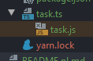

# Kilka ważnych informacji

Przed przystąpieniem do rozwiązywania zadań przeczytaj poniższe wskazówki

## Jak zacząć?

1. Stwórz [*fork*](https://guides.github.com/activities/forking/) repozytorium z zadaniami.
2. Sklonuj repozytorium na swój komputer. Użyj do tego komendy `git clone adres_repozytorium`
Adres repozytorium możesz znaleźć na stronie repozytorium po naciśnięciu w guzik "Clone or download".
3. Rozwiąż zadania i skomituj zmiany do swojego repozytorium. Użyj do tego komend `git add nazwa_pliku`.
Jeżeli chcesz dodać wszystkie zmienione pliki użyj `git add .` 
Pamiętaj że kropka na końcu jest ważna!
Następnie skommituj zmiany komendą `git commit -m "nazwa_commita"`
4. Wypchnij zmiany do swojego repozytorium na GitHubie.  Użyj do tego komendy `git push origin master`
5. Stwórz [*pull request*](https://help.github.com/articles/creating-a-pull-request) do oryginalnego repozytorium, gdy skończysz wszystkie zadania.

Poszczególne zadania rozwiązuj w odpowiednich plikach.

# Poniżej znajdziesz wytyczne do zadań

# Typescript — wprowadzenie

Typescript pozwala na statyczną kompilację kodu. Kompilacja taka pozwala na przeanalizowanie kodu
**przed jego uruchomieniem** celem wykrycia potencjalnych błędów.

**Pamiętaj o uruchomieniu `npm install` aby przygotować biblioteki przed rozpoczęciem pracy!**

## Statyczna kompilacja vs dynamiczne uruchamianie

Czas porównać zysk z używania TypeScript do „tradycyjnego” JavaScript w praktyce!

W pliku `task.js` znajduje się kod, który zawiera kilka błędów — żaden z nich nie jest jednak błędem
gramatyki języka, wobec czego plik nadal się uruchamia, ale zatrzymuje na błędach w momencie wykonania.

Skopiuj kod w całości bez zmian do sąsiedniego pliku `task.ts`. Jeśli nie widzisz któregokolwiek z plików,
spróbuj rozwinąć strzałkę przy jednym z nich — niektóre edytory automatycznie traktują pliki JS/TS jako dwie
wersje tego samego kodu:



W kodzie pliku znajdują się zakomentowane problematyczne linijki (trzy różne problemy). Po skopiowaniu
kodu do pliku TypeScript uruchom pliki równocześnie z użyciem skryptów:

- `npm start` dla pliku `task.js`
- `npm run typescript` dla pliku `task.ts`

Następnie po kolei dodawaj i usuwaj komentarze sprzed 3 problematycznych bloków i przeanalizuj dla każdego
przypadku zawartość konsoli. Porównaj rezultaty między JS a TS (np. czy pojawiają się w konsoli
wywołania poprzednich `console.log`, jak deskryptywne są błędy).

Zapisz rezultaty do pliku `conclusions.txt`.

# Typescript — konfiguracja projektu

Wystarczy kilkanaście minut, aby przygotować projekt pod proces budowania TypeScript. Centralnym
punktem konfiguracji TS jest plik `tsconfig.json`.

**Pamiętaj o uruchomieniu `npm install` aby przygotować biblioteki przed rozpoczęciem pracy!**

## Migracja na TypeScript

Wyobraź sobie, iż decydujesz się dodać TypeScript do istniejącego już projektu. Wiele osób staje wtedy
przed dylematem: **czy czas poświęcony migracji na TypeScript będzie tego wart**? W tym zadaniu postaramy
się udowodnić, iż migracja kodu na TypeScript nie musi być trudna - wystarczy kilka kroków!

W repozytorium znajduje się kawałek prostego kodu - w pliku `src/app.js` w pętli wywoływane jest
powitanie. Twoim zadaniem będzie migracja na Typescript w sposób, który pozwoli na łatwą edycję 
jego TypeScriptowej wersji oraz zbudowanie produukcyjnej paczki. Aby to osiącnąć będziesz musiała/musiał:

- Zainstalować powiązane z TypeScriptem paczki
- Dodać bazową konfigurację TypeScriptu do projektu
- Dodać do sekcji `scripts` pliku `package.json` nowe skrypty
- Zmodyfikować plik `app.js` tak, aby wczytać poprawnie plik `test.json` - teraz możliwe będzie użycie tego
importu!

## Dodanie bibliotek to projektu

Aby uruchamiać i budować pliki TS, będziemy potrzebować trzech paczek:

- `typescript` - (dependencies) - główna biblioteka TypeScript. Musi być dodana do każdego projektu wykorzystującego
TypeScript.
- `tsc` (devDependencies) - kompilator TypeScript. Przygotuje finalny zbudowany plik JS, który może być przekazany
do np. produkcyjnych skryptów.
- `ts-node` (devDependencies) - narzędzie, które pozwala na żywo kompilować TypeScript do JS. W połączeniu z
Nodemonem pozwala na **edycję plików TS na żywo**.

W nawiasach podano sekcje, w których mają się znaleźć dane paczki (użyj `npm i` bądź `npm i --save-dev` z nazwą
paczki, aby zainstalować je w odpowiedniej sekcji).

### Dodanie konfiguracji

Czas dodać do naszego projektu bazową konfigurację TypeScript. Naszym celem będzie:

- Zamiana eksperymentalnej składni import/export na zrozumiałą przez NodeJS składnię CommonJS (`require()`) -
nigdy więcej niepotrzebnych flag w skryptach!
- Umożliwienie ładowania pliku JSON - `tests.json` tak, jakby był on normalnym eksportem JS
- Zapisanie plików gotowych do serwowania w środowiskach produkcyjnych w katalogu `build`.

Aby osiągnąć taki rezultat, stwórz plik `tsconfig.json` w głównym katalogu repozytorium zadania
i dodaj jego treść (nie musisz usuwać komentarzy, `tsconfig.json` wspiera 5-tą wersję standardu
 JSON, która zezwala na komentarze):

```json5
{
  "compilerOptions": {
    "module": "commonjs", // For changing "import/export" to "require()" in resulting code
    "outDir": "build", // Resulting directory
    "moduleResolution": "node", // Way of resolving library module dependencies (this one uses node_modules)
    "resolveJsonModule": true, // For resolving JSON properly
    "allowSyntheticDefaultImports": true // For being able to use destructuring in imports with JS/JSON
  },
  "include": ["src/**.ts"], // Source files
  "exclude": ["node_modules", "**/*.spec.ts"] // Ignores
}
```

Teraz zostało jedynie przygotować skrypty i plik wyjściowy!

### Konfiguracja skryptów

Aby mieć pełną kontrolę nad projektem, przygotujemy trzy skrypty:

- `start-ts`, który pozwoli na pisanie kodu TS na żywo.
- `start-built` (nie podnieniamy oryginalnego skryptu `start` tylko ze względu na możliwość późniejszego porównania
z oryginałem!), który będzie odpowiednikiem skryptu `start` dla zbudowanego kodu.
- `build`, który wyzwoli kompilator TS.

Finalnie sekcja skryptów powinna wyglądać następująco:

```json
{
  "scripts": {
     "build": "tsc",
     "start": "nodemon --experimental-modules --es-module-specifier-resolution=node --no-warnings src/app.js",
     "start-built": "nodemon build/app.js",
     "start-ts": "nodemon --exec ts-node \"src/app.ts\""
   }
}
```

Zauważ, że w trybie produkcyjnym (`start-built` możemy pominąć wszystkie eksperymentalne flagi - dzięki
odpowiedniej konfiguracji TS, kompilator TypeScript zamieni składnię `import/export` na standardową składnię
`require()`). Kompilator zaś (skrypt `build`) nie wymaga żadnych argumentów - ponieważ nazwa pliku konfiguracyjnego
zgadza się z domyślą, zostanie on **automatycznie wykorystany** do budowania kodu.

## Zmiana pliku aplikacji na TypeScript

Ten krok jest stosunkowo prosty - stwórz w folderze `src` plik `app.ts` i skopiuj do niego zawartość jego
odpowiednika ze świata JS. Następnie odkomentuj import i usuń zbędną zmienną `greeting` - import JSON
powinien działać dzięki odpowiedniej konfiguracji TS.

Rezultat powinien zachowywać się **tak samo przy uruchamianiu, jak plik JS**.

## Uruchamianie i budowanie projektu

Sprawdź, czy udało Ci się poprawnie skongfigurować cały projekt. Jeśli skrypty budujące i uruchamiające
działają poprawnie, przeanalizuj następujące rzeczy:

- Jak długo zajmuje budowanie pliku TS?
- Czy widzisz wyraźną różnicę między uruchamianiem w trybie deweloperskim (`npm start` i `npm start-ts`) 
pomiędzy plikami JS i TS?
- Sprawdź zawartość zbudowanego po uruchomieniu skryptu budującego katalogu `build`. Porównaj go z oryginalnym
katalogiem.

Zapisz wszystkie przemyślenia do pliku `conclusions.txt`.

**UWAGA**

*Zauważ, iż plik JS (oraz powiązany z nim skrypt) zostawiamy w projekcie **tylko i wyłącznie na cele porównania**.
W przypadku pełnej migracji na TS zostałyby one usunięte i w pełni zastąpione TypeScriptowymi odpowiednikami*.

# Typy podstawowe

TypeScript wspiera w ramach statycznej kompilacji wszystkie typy podstawowe znane z JS. Poza typami podstawowymi
oferuje on też potężny silnik analizy statycznej, pozwalający na definiowanie własnych typów.

**Pamiętaj o uruchomieniu `npm install` aby przygotować biblioteki przed rozpoczęciem pracy!**

**Plik TypeScript uruchomisz komendą `npm run ts`, a plik JS - `npm start`**

## Autostopem przez Galaktykę

Douglas Adams opublikował w 1979 roku książkę opisującą losy zwykłego Ziemianina — Artura Dent-a — który
wyrusza na zwariowaną podróż przez Galaktykę zaopatrzony jedynie w ręcznik oraz towarzystwo zwariowanego
kosmity.

Na swojej drodze napotyka on (**SPOILER ALERT!**) superkomputer, który stoi przed zadaniem udzielenia odpowiedzi
na **Wielkie pytanie o życie, wszechświat i całą resztę (ang. Ultimate Question of Life, the Universe, and Everything)**.
Komputer liczył odpowiedź przez miliardy lat, aby ostatecznie dojść do ostatecznej odpowiedzi.

W pliku `app.js` znajduje się kod, symulujący komputer udzielający takiej odpowiedzi. Składa się on
z dwóch elementów:

- `questionTransformer`, transformującego zadane pytanie na język zrozumiały przez maszynę.
- `whatIsTheMeaningOf`, który udziela wcześniej odpowiedzi na bazie wcześniej już wyliczonej odpowiedzi.

Kod ten jednak nie działa tak, jak powinien — wynika to z niespójności w jego działaniu-typy nie są 
zachowane, a operacje w ramach „transformera” nie zwracają poprawnej wartości.

Skopiuj cały kod pliku do sąsiedniego pliku `app.ts` i uruchom go odpowiednim skryptem (ponieważ kod JS
jest poprawnym kodem TS, przed dodaniem typów nie spowoduje to jeszcze błędu kompilacji). 

Znajdź wszystkie błędy w kodzie z pomocą TypeScriptu. Stwórz typy dla obu metod, a następnie przypisz
je do nich tak, aby statyczny kompilator TypeScript sprawdził, czy są one poprawnie zaimplementowane.
Następnie popraw **wszystkie błędy** jakie znajdzie kompilator i zobacz, jaki otrzymasz rezultat.

Stwórz następujące typy:

- typ `QuestionTransformer`, który przyjmuje parametr `what` będący **String-iem** i zwraca wartość **numeryczną**
- typ `WhatIsTheMeaningOf`, który przyjmuje parametr `what` będący **numerem**, a zwraca wartość **string**

Następnie dodaj stworzone typy do powiązanych funkcji. Teraz możesz na podstawie znalezionych problemów
zmodyfikować kod tak, aby zwracał poprawny rezultat!

**PODPOWIEDŹ**

*Aby poprawnie uzyskać tablicę znaków ze zmiennej znakowej, możesz użyć metody `Array.from()`*

Oceń w pliku `conclusion.txt` czy przejście na TypeScript według Ciebie ułatwiło znalezienie błędów w kodzie
i opisz wszystkie błędy, jakie znalazł kompilator.

**PODPOWIEDŹ 2**

*Aby przypisać typ do zmiennej, wystarczy, iż dodasz go w jej deklaracji. W przypadku funkcji będzie to np*:

```typescript
const whatIsTheMeaningOf: WhatIsTheMeaningOf = (what) => {
  // ... Rest of the code
}
```

*Nie musisz modyfikować ani sygnatury metody ani zwracanego parametru - zagwarantuje do odpowiednia definicja
samego typu*.

# Typy podstawowe

TypeScript wspiera w ramach statycznej kompilacji wszystkie typy podstawowe znane z JS. Poza typami podstawowymi
oferuje on też potężny silnik analizy statycznej, pozwalający na definiowanie własnych typów.

**Pamiętaj o uruchomieniu `npm install` aby przygotować biblioteki przed rozpoczęciem pracy!**

**Plik `src/app.ts` uruchomisz komendą `npm run start`.**

## Między drapieżnikami

W pliku `app.ts` znajduje się lista drapieżników w którą... Zamieszały się zwierzaki drapieżnikami niebędące. 
Podszywają się one pod drapieżniki, raportując, iż ich dieta jest dietą drapieżnika, ale zapomniały 
o innych ich właściwościach, które mogą je zdradzić.

Przyjrzyj się zawartości tablicy. Część ze zwierząt w niej nie zawiera pewnych właściwości bądź zawiera właściwości
dodatkowe, które wskazują na to, iż drapieżnikami nie są.

Skonstruuj definicję takiego interfejsu, który jednoznacznie określi drapieżnika. a następnie
użyj go z tablicą tak, aby **wszystkie obiekty opisujące zwierzęta niebędące drapieżnikami zostały
zaraportowane jako błąd**, a każdy drapieżnik został uznany za poprawny obiekt.


**PODPOWIEDŹ**

*W interfejsie możesz też podawać pola, które **są stałymi** - wtedy każdy obiekt implementujący interfejs
musi przekazać dokładnie taką wartość, jaką definiuje interfejs, np.*:

```typescript
interface Animal {
  // ...
  diet: 'carnivore';
  // ...
}
```

# Klasy i TypeScript

TypeScript wspiera w ramach statycznej kompilacji wszystkie typy podstawowe znane z JS. Poza typami podstawowymi
oferuje on też potężny silnik analizy statycznej, pozwalający na definiowanie własnych typów.

**Pamiętaj o uruchomieniu `npm install` aby przygotować biblioteki przed rozpoczęciem pracy!**

**Plik `src/app.ts` uruchomisz komendą `npm run start`.**

## Katalog owoców

Budujesz katalog produktów i chcesz wykorzystać potęgę TypeScriptów do zdefiniowania klas zajmujących
się obsługą owoców. Chcesz przygotować hierarchię dziedziczenia, która pozwoli Ci na 
wygodne re-używanie części ze standardowych właściwości produktów oraz dodanie specyficznych dla
konkretnych produktów (w tym wypadku - owoców) metod i właściwości.

Zaimplementuj następujące konstrukty w kodzie `app.ts`:

**Item**

Interfejs, który zawiera dwa wymagane pola i jedno pole opcjonalne:

- `name` typu `string` - nazwa produktu
- `amount` typu `number` - ilość produktu na składzie
- `availableForRetail` - flaga, definiująca czy produkt jest obecnie sprzedawany, opcjonalna

**Edible**

Klasa **abstrakcyjna** posiadająca jedną metodę i jedną właściwość. Powinna **implementować interfejs `Item`**:

- `eat(amount)` - metoda, która zmniejsza ilość produktu o zadaną wartość (typ `number`. Zwraca nową wartość.
- `expiresAt` - właściwość typu `Date`, która zawiera informację o tym, kiedy kończy się ważność produktu

Nie zapomnij o zaimplementowaniu konstruktora klasy — powinien on przyjmować wszystkie parametry wymagane
przez `Item` oraz parametr `expiresAt` - łącznie 3 parametry i ustawiać ich wartość w odpowiednich polach.

**Sweet**

Interfejs, zawierający jeden wymagany parametr - `sweetness` typu `number`

### Klasa główna

Na bazie powyższych stwórz klasę `Fruit`, która rozszerza poprawnie abstrakcyjną klasę `Edible` oraz 
imlpementuje interfejs `Sweet`. Powinna ona w konstruktorze przyjmować wszystkie parametry wymagane przez klasę 
abstrakcyjną oraz dodatkowy parametr z interfejsu `Sweet` (łącznie 4 parametry).

Po zaimplementowaniu klasy głównej odkomentuj zawartość asercji i sprawdź, czy wywołują się one poprawnie.

**PODPOWIEDŹ**

*Pamiętaj o wywołaniu `super()` w obrębie klasy dziedziczącej po
`Edible` z odpowiednią sygnaturą!*

**PODPOWIEDŹ 2**

*Aby poprawnie zaimplementować interfejs, musisz powtórzyć jego właściwości w klasie tak,
aby kształt klasy zawierał wszystko, czego wymaga interfejs*.

---

Repozytorium z ćwiczeniami zostanie usunięte 2 tygodnie po zakończeniu kursu. Spowoduje to też usunięcie wszystkich forków, które są zrobione z tego repozytorium.
